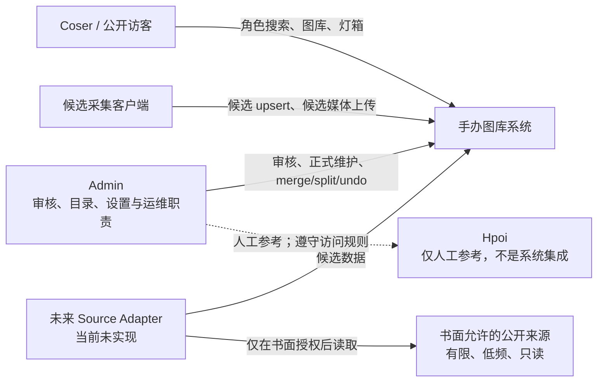
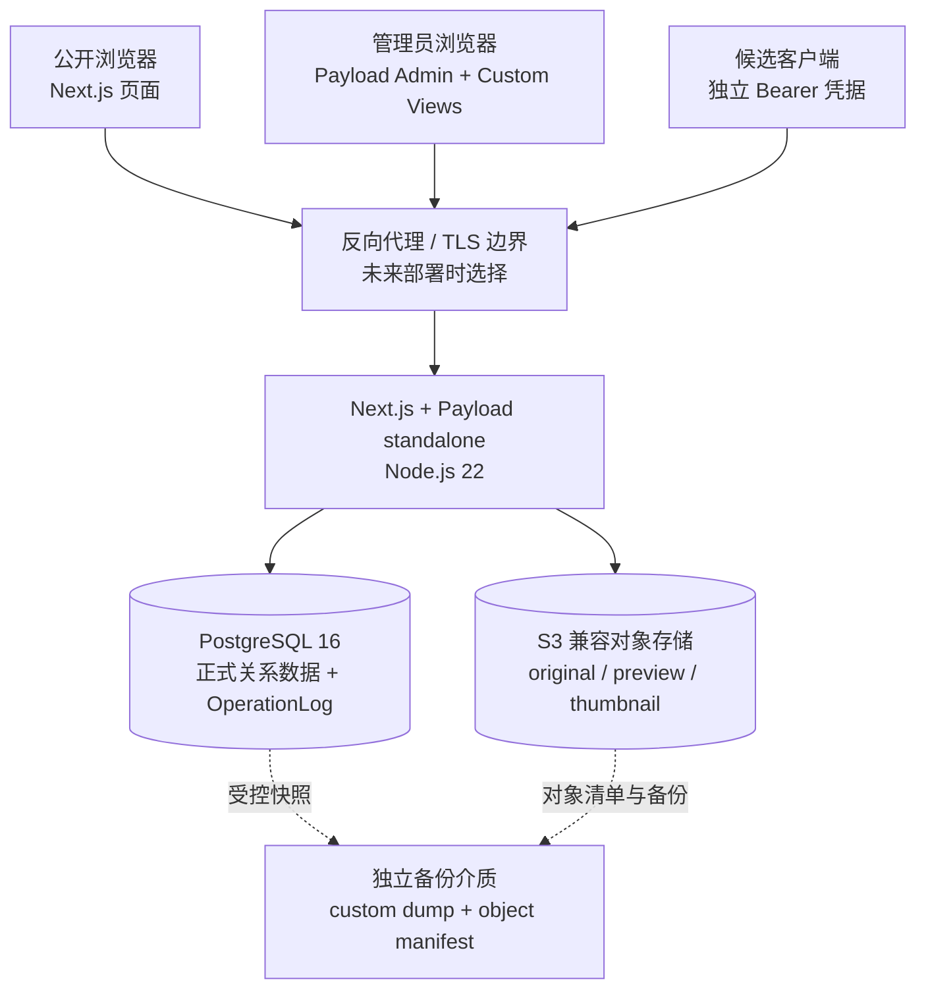
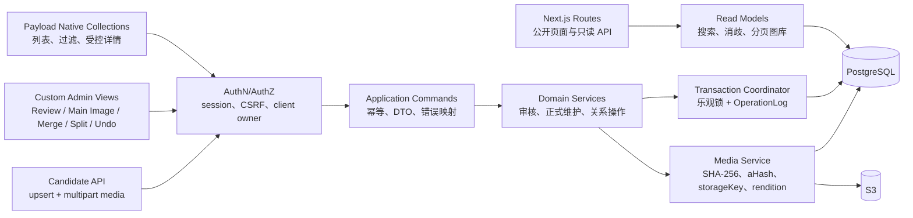
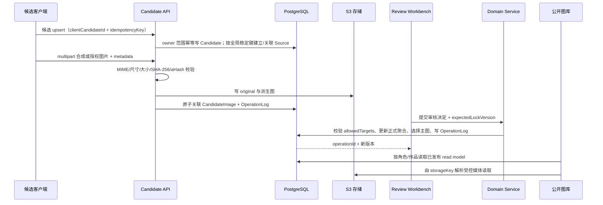

# 手办图库正式产品系统架构蓝图

## 1. 文档状态与边界

本文是正式产品的**规划蓝图**，不是已经存在的应用、基础设施或部署说明。仓库当前只包含研究结论和可丢弃 spike；本文中的目录、接口、组件和运行拓扑只有在后续获得明确授权后才可创建。

技术决策以 [`TECH_STACK_DECISION.md`](../research/TECH_STACK_DECISION.md) 为准，生产门禁证据见 [`PAYLOAD_CI_PRODUCTION_GATE.md`](../research/PAYLOAD_CI_PRODUCTION_GATE.md)。本蓝图不得被解释为：

- 已把任何 `spikes/` 目录迁移为正式代码；
- 已创建生产数据库、对象存储、域名或云资源；
- 已授权采集、部署或导入真实手办图片；
- 已改变外部网站访问规则。

## 2. 产品目标与不变量

产品面向需要按角色查找动作参考的 Coser，建设正版比例手办和景品图库。

第一阶段内容范围：

- 收录正版比例手办和景品；已发售、预售、未发售、完整灰模及正式授权第三方厂商均可进入候选池；
- 不收录未授权 GK、同人自制和盗版；黏土人、可动人偶、盲盒等不是第一阶段类型；
- 不同厂商或不同原型即使动作相似也分别建模；同一原型的普通版、豪华版、再版、特典版和纯异色版归入同一 FigurePrototype，并以 FigureVersion 表达；
- 每个原型可以保存多张候选图，由人工选一张正式主图；公开端每个原型只展示该主图；
- 外部来源只用于发现、补充和核验，任何来源都不是在线产品的强依赖，也不能绕过候选审核。

第一版公开交互范围：

- 类 Google 的极简角色搜索首页；唯一角色匹配时直接进入图库，同名角色按作品消歧；
- 角色页顶部显示大标题角色名，使用分页，桌面/平板/手机分别为 4/3/2 列；
- 图片保持原始宽高比且不裁切；点击后只提供放大、缩放、关闭和当前分页内上一张/下一张，并处理首末边界；
- 成人图片默认隐藏，只在管理员设置允许时显示；
- 不展示前台手办详情，不提供下载按钮，也不把对象存储原始地址当成下载契约。

必须长期保持以下不变量：

1. 外部来源数据只能进入候选池，不能直接写正式数据。
2. Work、Character、Manufacturer、FigurePrototype、FigureVersion、正式主图和系统设置的变化必须由管理员确认。
3. 同一手办原型的普通版、豪华版、再版、特典版和纯异色版归入同一 FigurePrototype，通过 FigureVersion 表达版本；不同厂商或不同原型分别建模。
4. 正式主图只能人工选择，重新采集、来源失效或候选删除不得自动替换或删除它。
5. 每个正式变化必须在同一原子边界内写 OperationLog；审计失败等同业务失败。
6. Merge、split 和 undo 使用稳定 operation ID、作用域、版本和依赖，不允许“撤销全局最近一次”或静默覆盖。
7. 候选客户端使用独立、可撤销、可归因凭据；服务端只保存凭据哈希，并强制 owner 隔离。
8. 图片内容身份以 SHA-256 为准，感知哈希只辅助相似性判断；公开 URL 不作为业务身份。

## 3. 已接受技术边界

| 层 | 选择 | 约束 |
| --- | --- | --- |
| CMS 与领域后台 | Payload CMS `3.86.x` | 正式初始化时锁定精确 patch；升级必须重跑生产门禁 |
| Web 与服务端运行时 | Next.js `16.2.x` | App Router；Payload 与公开前台共享受控服务端边界 |
| UI | React `19.2.x` | 公共图库和自定义 Admin view 共用设计 token，不共享越权数据接口 |
| 语言 | TypeScript | `strict`；领域命令、API DTO 和审计事件必须有显式类型 |
| JavaScript 运行时 | Node.js `22.x` | 正式构建与运行版本一致；锁文件安装 |
| 数据库 | PostgreSQL `16.x` | 唯一正式数据存储；migration 显式、不可自动推导生产 schema |
| 媒体存储 | S3 兼容对象存储 | 业务关系保存稳定 `storageKey`；endpoint、签名 URL 和公开 URL 可变 |
| 生产形态 | Next.js/Payload `.next/standalone` | 正式 server，不依赖 `next dev`；构建产物与 release manifest 绑定 |

`x` 表示被接受的兼容线，不表示可以无审查自动升级。正式项目必须在锁文件和 release manifest 中记录精确版本。

## 4. 计划目录树

下列结构仅记录目标布局，**本任务不创建这些目录或应用代码**：

```text
figure-gallery/
├── apps/
│   └── web/
│       ├── src/
│       │   ├── app/
│       │   ├── collections/
│       │   ├── globals/
│       │   ├── domain/
│       │   ├── endpoints/
│       │   ├── access/
│       │   ├── hooks/
│       │   ├── jobs/
│       │   ├── migrations/
│       │   └── tests/
│       ├── public/
│       ├── package.json
│       └── payload.config.ts
├── packages/
│   ├── domain-contracts/
│   ├── candidate-client/
│   ├── media-contracts/
│   └── test-fixtures/
├── infra/
│   ├── compose/
│   ├── scripts/
│   └── examples/
├── docs/
├── research/
└── spikes/
```

`apps/web/` 必须在后续获授权的正式初始化任务中从 Payload CMS + Next.js 官方脚手架干净创建，再按本蓝图逐步实现。`domain-contracts/` 保存框架无关的领域命令、DTO、事件、错误码和导出 schema；`media-contracts/` 保存 `storageKey`、媒体描述、rendition、对象 manifest 和哈希契约；`candidate-client/` 只能依赖这两类公开契约并暴露候选 upsert、媒体上传、sync/idempotency result，不得提供正式写方法；`test-fixtures/` 只生成合成数据和图片。

`infra/` 只保存非秘密的本地/CI 配置、脚本和示例，不代表已部署环境。`research/` 是历史证据，永不作为运行时依赖；`spikes/` 是可丢弃验证，正式 workspace、构建、package manifest 和应用代码永不依赖或导入其中任何内容。禁止复制、移动或重命名 `spikes/val02_payload/`、`spikes/payload_prod_gate/` 或其他 spike 作为正式起点。

## 5. 系统上下文（Context diagram）



外部来源不是系统可信边界的一部分。图中不存在系统或 Source Adapter 到 Hpoi 的自动读取路径：Hpoi 只允许人工参考；没有明确书面许可时不得为 Hpoi 创建或启用 adapter。其他 Source Adapter 也只有在未来任务明确授权具体来源、频率和字段后才能实现，并且只能低频、只读地产生候选数据。系统不保存或使用外部账号 Cookie、私人 Token，也不绕过反自动化或访问控制机制。

## 6. 容器视图（Container diagram）



反向代理、TLS 和独立备份介质是目标部署边界，目前没有选定供应商或创建资源。数据库和对象存储不得直接暴露给浏览器或候选客户端。

## 7. 服务端组件视图（Component diagram）



Payload hook 只能做输入归一化、访问拒绝和调用 application/domain service，不能承载跨记录业务本身。`overrideAccess`、Local API 或 Admin generic save 不得成为绕过领域服务的后门。

## 8. 核心数据流



如果 S3 写入成功而数据库事务失败，媒体服务必须执行补偿删除；补偿失败进入明确的孤儿对象审计队列，不得返回业务成功。若审计日志写入失败，正式变化整体回滚。

## 9. 运行时与信任边界

### 9.1 进程与网络

- 一个 `.next/standalone` 进程承载 Next.js 页面、Payload Admin、API 和领域服务；未来只有在容量证据要求时才拆分。
- PostgreSQL 与 S3 使用独立网络身份；应用凭据按环境隔离且最小权限。
- 应用只信任显式反向代理链；未配置可信代理时不得接受外部转发身份头。
- 管理端使用 Payload session、CSRF 保护和管理员角色；候选客户端使用独立 Bearer 凭据；公开读端不获得写能力。
- 运行时秘密只来自环境注入或后续选定的秘密管理边界，不进入 Git、构建产物、日志或 Artifact。

### 9.2 媒体寻址

数据库保存逻辑 `storageKey`、SHA-256、aHash、尺寸、格式和 byte size。适配器在运行时把 `storageKey` 映射到 bucket/prefix；签名 URL、公开 URL、endpoint 和 CDN URL 都是可替换的交付表达，不写入业务唯一键。

原图与 `preview`、`thumbnail` 分开记录。派生图可以从原图重建；原图缺失不得伪造“重建成功”。已经成为正式主图的媒体受正式引用保护，来源或候选生命周期不能级联删除它。

## 10. 聚合与事务边界

领域只有以下四个业务聚合；Work、Character、Manufacturer 等是 Formal Figure 的受控引用实体，不另起一套跨记录写边界：

| 聚合 | 根与成员 | 允许的命令 | 原子不变量 |
| --- | --- | --- | --- |
| **Candidate** | CandidateRecord、CandidateImage、全局 SourceRecord 引用、CandidateCommandReceipt、UploadReceipt；引用 CandidateClient/MediaAsset | owner 范围 upsert、multipart、只读结果、软删除 | Candidate owner 不跨 client；SourceRecord 稳定键全局唯一、首次发现归因不可改、仅由服务端建立/关联和维护非私密元数据；client 无 SourceRecord 直接 CRUD；不得写正式目录 |
| **Formal Figure** | FigurePrototype、FigureVersion、FigureImage、正式媒体/来源关系；受控引用 Work、Character、Manufacturer | 正式维护、发布/隐藏/归档、主图 | 只由 Admin/已验证 Review 命令修改；主图属于有效正式媒体；同事务 OperationLog |
| **Review** | ReviewWorkItem、allowed targets、field decisions | open/claim/accept/reject/defer/ignore/complete/reopen | 目标受工作项约束；后提交明确冲突；完成项普通入口不可改 |
| **Merge/Split** | operation ID、完整 scope、versions、dependencies、before/after/inverse | merge、split、按 ID undo | 所有关系与 OperationLog 同一 PostgreSQL 事务；依赖冲突默认拒绝 |

MediaAsset、MediaObject 与对象任务是 supporting Media boundary，不是第五个业务聚合；数据库状态可原子更新，对象写入使用 staging、幂等任务和补偿。

跨聚合命令由 domain service 持有事务边界：

- **审核完成**：锁定 ReviewWorkItem，校验 allowed target，更新/新建正式目标，选择字段和主图，推进 lock version，写 OperationLog，然后一次提交。
- **Merge/Split/Undo**：锁定受影响 prototype/version 及 scope，校验 expected version 和 dependency graph，应用关系变化，写稳定 operation ID 与可撤销信息，然后一次提交。
- **正式主图选择**：锁定 FigurePrototype 与媒体引用，验证媒体已完整落库且允许提升，更新主图并写审计；不删除旧对象。
- **候选媒体上传**：对象写入、哈希校验、数据库关联与审计组成补偿式事务；任何失败都不能产生残缺正式记录。

## 11. Admin 信息架构

Admin 导航必须使用以下固定分组。`Native` 表示 Payload 原生 Collection/Global 的列表、过滤或详情能力；`Custom` 表示自定义 view/command UI。即使使用 Native 表单，正式写入也必须调用同一领域 service 和 OperationLog，不能退化成无审计 generic save。

| 分组 | 项目 | Native / Custom | 作用与写边界 |
| --- | --- | --- | --- |
| **Review** | Pending Candidates | `Custom` queue | 新候选待审队列；打开 Review Workbench，不直接保存正式字段 |
| **Review** | Update Pending | `Custom` queue | 已对应正式目标但字段/图片变化待审；显示 diff 与原主图保护 |
| **Review** | Deferred | `Custom` queue | 有明确 defer reason/期限的工作项；恢复处理要审计 |
| **Review** | Ignored | `Custom` queue | 被明确忽略的候选；与软删除分开，reopen 要审计 |
| **Review** | Review Work Items | `Native` list/detail + `Custom` workbench | 原生视图查历史、owner、reviewer、lock version；accept/reject/defer/ignore/complete/reopen 只在 workbench |
| **Catalog** | Works | `Native` collection | 列表、过滤、受控详情；写命令走 catalog service |
| **Catalog** | Characters | `Native` collection | 作品关系、aliases、公开状态；写入带版本和审计 |
| **Catalog** | Manufacturers | `Native` collection | 名称、别名和状态；被引用记录不物理删除 |
| **Catalog** | Figure Prototypes | `Native` list/detail + `Custom` workspace | 原生浏览；新建、隐藏/恢复、主图与跨记录动作走受控命令 |
| **Catalog** | Figure Versions | `Native` list/detail + `Custom` attach action | 原生浏览；归入/拆出 prototype 走事务化领域命令 |
| **Media** | Candidate | `Native` filtered media view | 只读 candidate media、owner、source、hash 和 rendition；不能在此提升主图 |
| **Media** | Formal | `Native` filtered media view | 浏览已正式引用媒体和保护关系；物理删除关闭 |
| **Media** | Duplicate Suggestions | `Custom` view | 基于 SHA-256/aHash 给人工建议，不自动合并或替换 |
| **Media** | Missing Objects | `Custom` diagnostic | DB 期望但 S3 缺失；正式原图缺失触发硬事件 |
| **Media** | Orphan Audit | `Custom` diagnostic | 展示 S3 orphan，默认只读且不自动删除 |
| **Sources** | Source Records | `Native` collection + `Custom` manual/import actions | 来源身份与关系浏览；Admin 人工候选表单/明确允许的离线 JSON/CSV 导入只写 Candidate 聚合且不 fetch URL；状态变化走专用命令 |
| **Sources** | Stale | `Native` filtered view + `Custom` action | 标记需要复核，不删除候选或正式对象 |
| **Sources** | Dead | `Native` filtered view + `Custom` action | 标记来源不可用；正式主图仍受保护 |
| **Sources** | Candidate Clients | `Native` list/detail + `Custom` credential action | 浏览 owner/active/last-used；创建一次性 token、撤销和轮换只走专用动作 |
| **Operations** | Merge | `Custom` console | 预览 scope、版本和依赖后执行事务化 merge |
| **Operations** | Split | `Custom` console | 显式选择版本/关系并预览结果后执行 split |
| **Operations** | Undo | `Custom` console | 只按 operation ID 指定撤销；依赖冲突默认拒绝 |
| **Operations** | Operation Log | `Native` read-only collection + `Custom` explorer | 原生检索/导出，扩展 view 展示 scope/dependency；永不编辑或删除 |
| **Settings** | Adult image visibility | `Native` Global + audited command | 控制成人图片是否可在公开端显示；默认隐藏 |
| **Settings** | Public read | `Native` Global + audited command | 公开只读总开关；不影响 Admin/恢复探针 |
| **Settings** | Gallery page size | `Native` Global + audited command | 受上限约束的分页大小，不改变 4/3/2 响应式规则 |
| **Settings** | Upload limits | `Native` Global + audited command | 候选文件 byte/尺寸限制；服务端强制，不信任客户端 |
| **Settings** | Allowed image formats | `Native` Global + audited command | 明确允许格式集合；MIME、magic bytes 和解码结果共同校验 |

Review Workbench 必须同屏预览全部候选图、支持字段 accept/reject、允许目标或显式新建正式原型、attach version、主图选择、理由、defer/ignore/complete/reopen 和冲突恢复。键盘操作、明确焦点、错误摘要和乐观冲突恢复是验收要求；视觉品牌设计不在本蓝图范围。

## 12. API 语义

所有写请求使用 `application/json`；候选媒体上传使用 `multipart/form-data`。错误响应统一为：

```json
{
  "error": {
    "code": "stable_machine_code",
    "message": "safe human-readable summary",
    "requestId": "opaque-id",
    "retryable": false,
    "details": {}
  }
}
```

`details` 不包含 Token、Cookie、数据库语句、对象存储凭据或内部堆栈。

### 12.1 候选客户端与同步

| 接口语义 | Actor / 认证 | Request | Response | 幂等 | 冲突 | Audit | 主要错误码 |
| --- | --- | --- | --- | --- | --- | --- | --- |
| `POST /api/admin/candidate-clients`（create client） | Admin（客户端管理职责）/ session + CSRF | display name、scope allowlist（`candidate:upsert`、`candidate:media-upload`、`candidate:result-read`）、reason、`commandId` | client ID、active，以及**仅本次**明文 token | `commandId` 重放返回同一 client，绝不再次返回 token | 名称/command payload 不同返回 409 | `candidate_client_created`；只记 token fingerprint | `administrator_required`、`candidate_client_name_conflict`、`idempotency_conflict` |
| `POST /api/admin/candidate-clients/{id}/disable` / `enable` | Admin（客户端管理职责）/ session + CSRF | reason、expected version、`commandId` | client ID、`disabled/active`、新版本 | 同状态为 unchanged | revoked 不可 enable；stale version 409 | `candidate_client_disabled/enabled` | `candidate_client_not_found`、`candidate_client_state_conflict`、`candidate_client_version_conflict` |
| `POST /api/admin/candidate-clients/{id}/rotate` | Admin（客户端管理职责）/ session + CSRF | reason、expected version、`commandId` | client ID、新版本，以及仅本次明文新 token；旧 token 立即失效 | command ID 重放不再次返回明文，须人工发起新 rotate | revoked/stale version 409 | `candidate_client_rotated`；不记明文/摘要 | `candidate_client_not_found`、`candidate_client_state_conflict`、`candidate_client_version_conflict` |
| `POST /api/admin/candidate-clients/{id}/revoke` | Admin（客户端管理职责）/ session + CSRF | reason、expected version、`commandId` | client ID、`revoked`、revokedAt、新版本 | 已撤销返回 `unchanged` | revoked 不可恢复；stale version 409 | `candidate_client_revoked` | `candidate_client_not_found`、`candidate_client_version_conflict` |
| `POST /api/admin/candidates/manual` | Admin（候选录入职责）/ session + CSRF | raw fields、可选 source URL 或稳定 source item ID、reason、`commandId` | internal-manual owner 下的 candidate/source/receipt IDs | command ID/规范摘要重放返回原结果 | 同 key 不同内容或来源身份冲突 409 | `manual_candidate_created` | `manual_candidate_invalid`、`source_identity_required`、`idempotency_conflict` |
| `POST /api/admin/candidates/import` | Admin（候选录入职责）/ session + CSRF | 明确允许的离线 JSON/CSV、schema version、file SHA-256、`commandId`；不含远程 fetch 指令 | import receipt、逐行 accepted/rejected 摘要 | file SHA + command ID；重复不重建候选 | 行 source identity 缺失/重复或 schema 不匹配明确报告 | `offline_candidate_imported` | `offline_schema_invalid`、`source_identity_required`、`idempotency_conflict` |
| `POST /api/candidates/upsert` | Candidate client / 独立 Bearer token + `candidate:upsert` | `clientRunId`、`clientOperationId`、`clientCandidateId`、source type/ID/URL、raw fields、`idempotencyKey` | candidate/source/receipt IDs、`created/updated/unchanged`、version；不返回 SourceRecord 快照或首次发现者 | 全局稳定 source ID 优先；服务端建立/关联 SourceRecord 并仅单调推进 lastSeen；同 key/operation 同 payload 返回原结果 | 同 key 不同 payload或跨 Candidate owner 冲突 409 | `candidate_upsert` | `candidate_client_required`、`invalid_or_revoked_credential`、`cross_client_owner_conflict`、`idempotency_conflict`、`validation_failed` |
| `POST /api/candidate-media` | Candidate client / Bearer token + `candidate:media-upload` | multipart file、`clientRunId`、`clientOperationId`、candidate/client media IDs、content type、size、hash、`idempotencyKey` | media/storageKey/receipt IDs、SHA-256/aHash、dedupe 状态 | 同内容可去重；安全重试返回原 media/result | 同 key 内容变化或 candidate 不属 owner 返回 409 | `candidate_media_upload` | `media_type_mismatch`、`unsupported_media_type`、`payload_too_large`、`candidate_media_storage_unavailable`、`candidate_media_commit_failed` |
| `GET /api/candidate-sync-results/{clientRunId}`（sync result） | Candidate client / Bearer token + `candidate:result-read` | path 中 run ID；无 body | 服务端聚合该 owner/run 的 pending/succeeded/failed、counts 与安全 receipt 摘要 | 只读；同 receipt 集合稳定 | 其他 owner 等同 404；不存在的 run 不泄露信息 | 结构化访问日志，不新增业务 OperationLog | `sync_result_not_found`、`invalid_or_revoked_credential` |
| `GET /api/candidate-idempotency/{key}`（idempotency result） | Candidate client / Bearer token | owner 范围的 key；无 body | operation kind、`pending/succeeded/failed`、安全结果摘要、retryable | 只读；同 key 稳定返回已持久结果 | 其他 owner 的 key 等同 404；不泄露存在性 | 结构化访问日志，不新增业务 OperationLog | `idempotency_result_not_found`、`invalid_or_revoked_credential` |

### 12.2 Review WorkItem 命令

除 `reopen` 外，Actor 都是当前 reviewer 的 Admin session + CSRF；每个请求都带 `commandId`、`expectedLockVersion` 和 reason（适用时）。同 command ID/同 payload 返回原结果，不同 payload 返回 `idempotency_conflict`；stale lock 返回 `review_version_conflict`，已完成项返回 `completed_review_item_immutable`。

| 接口语义 | Actor / 认证 | Request | Response | 幂等 | 冲突 | Audit | 主要错误码 |
| --- | --- | --- | --- | --- | --- | --- | --- | --- |
| `POST /api/review-items/{id}/start` | Admin / session + CSRF | expected lock、command ID | reviewer、startedAt、新 lock version | 重放原领取结果 | 已被他人领取或 stale 409 | `review_started` | `review_item_unavailable`、`review_version_conflict` |
| `POST /api/review-items/{id}/fields/{field}/accept` | 当前 reviewer / session + CSRF | candidate field value/ref、reason | accepted decision、新 lock version | command ID | 字段已被后续决定或 stale 409 | `review_field_accepted` | `review_field_invalid`、`review_version_conflict` |
| `POST /api/review-items/{id}/fields/{field}/reject` | 当前 reviewer / session + CSRF | field、reason | rejected decision、新 lock version | command ID | 与 accept 同一字段并发冲突 | `review_field_rejected` | `review_field_invalid`、`review_version_conflict` |
| `POST /api/review-items/{id}/targets/create-prototype` | 当前 reviewer / session + CSRF | 允许字段、work/character/manufacturer refs、reason | 新 prototype ID、operation ID、新 lock version | command ID 只创建一次 | 已选 target、越权字段或 stale 409 | `review_formal_prototype_created` | `review_target_out_of_scope`、`formal_validation_failed` |
| `POST /api/review-items/{id}/versions/attach` | 当前 reviewer / session + CSRF | allowed prototype/version IDs 或显式新 version、expected versions | prototype/version IDs、operation ID、新版本 | command ID；重复 attach 为 unchanged | target 越界、version 已归属其他 scope 或 stale 409 | `review_version_attached` | `review_target_out_of_scope`、`formal_version_conflict` |
| `POST /api/review-items/{id}/main-image` | 当前 reviewer / session + CSRF | candidate media ID、prototype ID、reason、expected versions | main image ID、operation ID、新版本 | 同图同命令返回原结果 | media 不完整/不属该 work item、原型 stale 409 | `main_image_selected` | `main_image_not_allowed`、`media_incomplete`、`formal_version_conflict` |
| `POST /api/review-items/{id}/defer` | 当前工作项 reviewer（同一 Admin 角色）/ session + CSRF | defer reason、可选 review-after | `workItemStatus=completed`、`decision=defer`、`candidateStatus=deferred`、新 lock version | command ID | 已完成/忽略/stale 409 | `review_deferred` | `defer_reason_required`、`review_version_conflict` |
| `POST /api/review-items/{id}/ignore` | 当前工作项 reviewer（同一 Admin 角色）/ session + CSRF | ignore reason | `workItemStatus=completed`、`decision=ignore`、`candidateStatus=ignored`、新 lock version | command ID | 已完成/延期/stale 409 | `review_ignored` | `ignore_reason_required`、`review_version_conflict` |
| `POST /api/review-items/{id}/complete` | 当前 reviewer / session + CSRF | decision summary、allowed target、reason | formal IDs、operation ID、status=`completed`、新版本 | command ID；已成功重放原结果 | 未决字段、越界 target、未选择必需主图或 stale 409 | `review_completed` 及同事务正式审计 | `review_incomplete`、`review_target_out_of_scope`、`main_image_not_allowed` |
| `POST /api/review-items/{id}/reopen` | Admin（审核职责）/ session + CSRF | reason、expected version、command ID | 旧项保持终态；新 `workItemStatus=reopened`、`candidateStatus=pending`、reopenedFrom ID/lock version | command ID | 后续依赖或 stale 409 | `review_reopened` | `review_reopen_forbidden`、`operation_dependency_conflict`、`review_version_conflict` |

字段 accept/reject 等中间决定也必须持久化到 ReviewWorkItem 历史，但只有 `complete` 能在同一事务内改变正式目标。`create-prototype` 与 `attach-version` 是工作项允许的显式正式动作，候选客户端永远不能调用。

### 12.3 正式领域与设置命令

| 接口语义 | Actor / 认证 | Request | Response | 幂等 | 冲突 | Audit | 主要错误码 |
| --- | --- | --- | --- | --- | --- | --- | --- | --- |
| `POST /api/formal/merge` | Admin / session + CSRF | source/target IDs、expected versions、reason、command ID | operation ID、scope、新版本 | command ID | 重叠 scope、stale 或依赖冲突 409 | `prototype_merged` | `operation_scope_conflict`、`formal_version_conflict`、`operation_dependency_conflict` |
| `POST /api/formal/split` | Admin / session + CSRF | prototype/version selection、expected versions、reason、command ID | operation ID、结果 IDs、新版本 | command ID | 关系不闭合、scope/stale 409 | `prototype_split` | `invalid_split_plan`、`operation_scope_conflict`、`formal_version_conflict` |
| `POST /api/formal/operations/{operationId}/undo` | Admin / session + CSRF | expected scope versions、reason、command ID、显式 cascade policy | undo operation ID、被撤销 ID、新版本 | command ID；只按指定 operation | 后续依赖存在默认 409 | `operation_undone` | `operation_not_undoable`、`operation_dependency_conflict`、`formal_version_conflict` |
| `POST /api/sources/{id}/status`（mark stale/dead） | Admin / session + CSRF | status=`stale/dead`、reason、expected version、command ID | source status、新版本、受保护正式媒体摘要 | 同状态重放为 unchanged | stale version 409；不能级联删除正式主图 | `source_marked_stale/dead` | `source_not_found`、`source_version_conflict`、`source_status_invalid` |
| `POST /api/sources/{id}/restore` | Admin / session + CSRF | 新合规/可用证据摘要、reason、expected version、command ID | status=`active`、新版本；正式关系与主图不变 | command ID；active 重放 unchanged | 证据不足、accessBlocked 或 stale version 409 | `source_restored` | `source_restore_evidence_required`、`source_access_blocked`、`source_version_conflict` |
| `POST /api/formal/{type}/{id}/visibility` | Admin / session + CSRF | `hidden/restored`、reason、expected version、command ID | 新状态、operation ID | command ID；同状态 unchanged | stale 409；物理删除不暴露 | `formal_hidden/restored` | `formal_version_conflict`、`formal_write_forbidden` |
| `PATCH /api/settings/{key}` | Admin（设置职责）/ session + CSRF | 五个允许 key 之一、value、expected version、reason、command ID | value、新版本、operation ID | command ID；同值 unchanged | stale 或非法组合 409 | `setting_changed` | `setting_version_conflict`、`setting_value_invalid`、`setting_key_forbidden` |

### 12.4 Public read 与运行探针

| 接口语义 | Actor / 认证 | Request | Response | 幂等 | 冲突 | Audit | 主要错误码 |
| --- | --- | --- | --- | --- | --- | --- | --- | --- |
| `GET /api/public/characters/search` | Public / 无认证、受限流 | normalized query | 唯一匹配直接目标或需要消歧的摘要 | 只读；相同查询/版本稳定 | 无写冲突；索引版本变化可改变结果 | 低基数结构化访问日志；不写 OperationLog | `query_invalid`、`public_read_disabled`、`rate_limited` |
| `GET /api/public/characters/disambiguation` | Public / 无认证 | query、可选 work filter | 同名角色的 character ID、显示名、work 摘要 | 只读 | 无；不返回未发布记录 | 结构化访问日志 | `query_invalid`、`not_found`、`public_read_disabled` |
| `GET /api/public/characters/{id}/gallery`（page navigation） | Public / 无认证 | `page`、受设置约束的 `pageSize` | 当前页主图、原始宽高、page/totalPages、首末边界；不含详情/下载动作 | 只读；响应可用 catalog version/ETag | page 越界 404；设置变化使旧 ETag 失效 | 结构化访问日志 | `not_found`、`page_out_of_range`、`public_read_disabled` |
| `GET /api/public/media/{id}/{variant}`（media read） | Public / 无认证 | media ID、`original/preview/thumbnail`；可选 Range | inline 媒体流、Content-Type/Length、ETag；无 attachment 下载契约 | GET/ETag；同内容 SHA 稳定 | 对象缺失明确 404/503，不自动换主图 | 结构化媒体访问日志，不记录签名 URL | `media_not_found`、`media_object_missing`、`media_storage_unavailable`、`adult_media_hidden` |
| `GET /health/live`、`GET /health/ready` | 内部 probe / 暴露策略另定 | 无 | 脱敏状态与 release ID | 只读 | 无业务冲突 | 结构化运行日志 | `not_ready` |

HTTP 语义：输入错误 400，未认证 401，权限拒绝 403，未找到 404，幂等/版本/作用域冲突 409，大小超限 413，类型不支持 415，限流 429，依赖暂时不可用 503。GraphQL 若保留，只开放明确只读查询；正式 mutation 不进入公开 schema，production introspection 默认关闭。

## 13. CI：15 个 fail-closed 阶段

正式 CI 采用单向、可重跑流水线；任一必需阶段失败都不能以跳过断言、历史证据或 SQLite 结果替代。

| 阶段 | 内容 | 关键产物 |
| --- | --- | --- |
| 1 | 固定 SHA 的官方 checkout/setup actions，记录 runner 与工具版本 | environment summary |
| 2 | Node 22 锁文件安装与 Python 测试环境准备；禁止全局项目依赖 | dependency/version summary |
| 3 | 治理、目录范围、合成 fixture、真实图片/凭据/Hpoi guard 检查 | policy summary |
| 4 | TypeScript typecheck、ESLint、格式、migration 静态检查、`git diff --check` | static-check summary |
| 5 | 纯领域单元测试与 SQLite 快速回归；明确标记 PostgreSQL-only skip | unit summary |
| 6 | 共享合同、API schema、幂等键、错误码和 network guard | contract summary |
| 7 | Next.js/Payload production build 与 standalone trace/Sharp 完整性预检 | build summary |
| 8 | 随机临时凭据、loopback PostgreSQL 16 + S3 服务、镜像 digest 与健康检查 | infrastructure summary |
| 9 | PostgreSQL 空库 migration、repeat migration、schema/约束签名 | migration summary |
| 10 | 合成 seed 两次、计数/稳定 ID/digest 幂等对照 | seed summary |
| 11 | PostgreSQL integration、并发、回滚、owner/主图/generic CRUD 攻击矩阵 | transaction/security summary |
| 12 | S3 原图/派生图、SHA-256/aHash、去重、生命周期、故障补偿、prefix 迁移 | media summary |
| 13 | custom dump + object manifest 联合快照、清空、恢复和对象审计 | recovery summary |
| 14 | 同提交 clean tree 的 `npm ci`、migration、seed、build、standalone clean/restart 与攻击重跑 | standalone summary |
| 15 | JSON/链接/凭据/大文件/二进制扫描，脱敏 Artifact manifest，`always()` 清理及零残留断言 | artifact + cleanup summary |

### 13.1 触发与权限策略

- `pull_request` 到 `main`：运行受影响的快速阶段；涉及正式代码、schema、storage、auth、workflow 或 lockfile 时必须运行全部 15 阶段。
- `push` 到 `main`：对合并提交重跑全部 15 阶段，生成与该 commit 绑定的脱敏 Artifact；**不触发部署**。
- `workflow_dispatch`：仅用于授权的全量回归和恢复演练；输入不得进入未转义 shell。
- 禁止 `pull_request_target`、外部 webhook、自动部署事件和从 Issue/PR 文本执行命令；默认不设 `schedule`，需要定期恢复演练时另行授权。
- `permissions: contents: read`；不读取或依赖仓库 Secret。临时凭据在 runner 内随机生成、mask、只存临时目录并在结束时销毁。
- 同一 PR/分支使用 concurrency group，新运行取消旧运行；受保护分支的最终必需检查不得被较早分支结果替代。
- 只使用固定不可变 SHA 的官方 Actions；CI 不写仓库、不发 Release/Package、不自动提交、不自动合并。

## 14. 备份、恢复与部署边界

### 14.1 备份与恢复

- 一个联合快照由 PostgreSQL custom-format dump、对象 manifest、共同 `snapshotId`、应用 release manifest 和逐文件 SHA-256 构成。
- 对象 manifest 至少包含 media ID、逻辑 storageKey、备份 key/版本、byte size、content type、SHA-256、aHash 和派生关系；不包含图片二进制本体。
- 数据库 dump 与对象备份必须进入与运行环境独立的介质；同服务不同 prefix 只可作为测试，不能称为灾备。
- 恢复只能进入空数据库和空 bucket/prefix，完成 schema、计数、关系、权限、正式主图、设置、missing/orphaned/hash 审计后才允许切换流量。
- 完整操作步骤和故障手册见 [`OPERATIONS_AND_RECOVERY.md`](OPERATIONS_AND_RECOVERY.md)。

### 14.2 部署

本文只规定边界，不执行部署：

1. 构建输入必须是受保护分支上的已验证 commit 和锁文件。
2. release manifest 绑定 Git SHA、精确依赖、migration head、构建与基础镜像 digest。
3. migration 由单一受控 migrator 先执行；多个应用实例不得并发自动改 schema。
4. Standalone 先在 loopback 启动，通过 readiness、Admin/静态/媒体/API smoke 后才可进入反向代理。
5. 数据库和 S3 不公开暴露；应用使用最小权限运行身份。
6. 不自动部署，不从 Draft PR 部署，不在本仓库保存生产凭据；任何环境创建和发布都需要独立授权。

## 15. 证据与重新评估

本蓝图的已验证依据包括：

- [`TECH_STACK_DECISION.md`](../research/TECH_STACK_DECISION.md)
- [`PAYLOAD_PRODUCTION_GATE_SPEC.md`](../research/PAYLOAD_PRODUCTION_GATE_SPEC.md)
- [`PAYLOAD_POSTGRES_RESULTS.md`](../research/PAYLOAD_POSTGRES_RESULTS.md)
- [`PAYLOAD_S3_RESULTS.md`](../research/PAYLOAD_S3_RESULTS.md)
- [`PAYLOAD_STANDALONE_RESULTS.md`](../research/PAYLOAD_STANDALONE_RESULTS.md)

Payload、Next.js、React、Node、PostgreSQL adapter、S3 plugin、Sharp、schema、认证、领域服务、storageKey 或 standalone 形态变化时，必须重新评估并重跑相关生产门禁。正式项目初始化、云资源选择和首次部署分别需要新的明确授权；本蓝图不授予这些权限。
