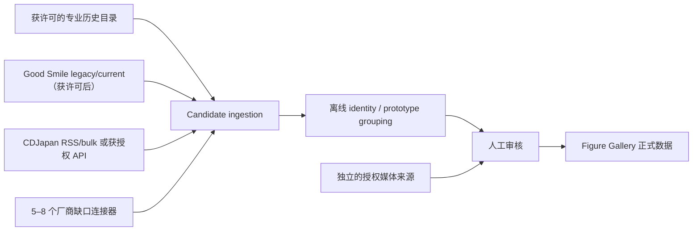

# Catalog Hub 建库战略：执行摘要

研究日期：2026-08-09

任务：DISCOVERY-RESEARCH-01R

性质：不超过 6 小时的只读研究与一次性离线分析；不是连接器实现。

## 结论

Catalog Hub 路线**值得继续，但只能作为经过书面许可门禁的部分供应链**。它能显著减少连接器数量和按角色重复搜索，却不能由本轮证据证明“三个站覆盖整个市场”，更不能把网页可访问等同于可长期复制、保存或公开媒体。

Good Smile 样本证明了目录枢纽的高产价值：41 条 source record 中有 33 条在 Figure Gallery 当前范围，研究级归并为约 27 个在范围 FigurePrototype；其中 8 个已在现有蕾姆 11 原型中，边际增加约 19 个，合并后约 30 个原型。POP UP PARADE Ice Season 的冻结规格与品类冲突，若以后证实为静态完整品，边际可增至 20。

但该成功不是“输入任意角色名即可自动获得全部”。Legacy 目录文本搜索能确定到达 35 个 identity；current 目录依赖 4 个手工 seed、首页和不完整的推荐图，而且没有保存父边或深度。4–6 个 current identity 在无 seed 条件下未证明可达。因此 Good Smile 是很强的历史样本，却不是可直接复制的通用发现算法。

## 核心数字

| 指标 | 结果 |
|---|---:|
| Good Smile source records / probable versions | 41 / 41 |
| 明确 release events 下限 | 46 |
| in scope / out of scope / ambiguous | 33 / 7 / 1 |
| 全部 probable prototypes | 35 |
| 在范围 probable prototypes | 27 |
| 现有 FG 蕾姆 prototypes | 11 |
| 交集 / Good Smile 边际 / 并集 | 8 / 19 / 30 |
| 配置 seed | 4 |
| 确定可由 legacy 文本搜索到达 | 35 |
| 图片 URL | 326；每记录 4–14，中位数 7 |
| 图片小样本 | 3 商品 × 4 图；12/12 HTTP 成功、12 个 SHA-256 |
| 完整造型图 | 6/12；2/3 商品有正背或多角度覆盖 |
| Hpoi 请求 | 0 |

完整机器摘要见 [`results.json`](../evidence/catalog-hub-discovery/results.json)。

## 十二个问题的直接回答

1. **41 条中在范围多少？** 33；明确超范围 7；证据冲突 1。
2. **约多少 unique prototypes？** 全部约 35；当前范围约 27。
3. **相对现有 11 条增加多少？** 约 19 个边际原型候选；并集约 30。
4. **是否依赖人工 seed？** Legacy 低依赖；current 高且不可审计，整体是混合结论。
5. **Good Smile 能否长期作为 Historical Hub？** 技术稳定性中等，许可不清；只能作为获得许可后的组成部分，不能单点依赖。
6. **最值得接的 2–3 个外部 Hub？** 许可谈判优先 HobbySearch、CDJapan RSS/bulk、MyFigureList；Rakuten Product API 只在持久化权利获书面澄清后作为结构化身份实验。
7. **并集能覆盖多少市场？** 本轮没有获授权的可穷举 union，因此不提供虚假百分比。必须以 probable prototype/JAN 交叉表实测。
8. **还需多少 direct maker connector？** 初步 5–8 个，而非 30 个；优先补 FuRyu、Taito、Bandai Spirits/Banpresto、KADOKAWA、APEX/ALTER 等真实缺口。
9. **Historical 与 Incremental 怎么做？** Historical 用获授权的专业历史目录和 legacy backfill；Incremental 用全局 RSS/feed/update cursor，一次摄取后离线分配角色。
10. **100/1000 角色如何避免重复搜网？** Bootstrap 可按角色限次查询；日常必须切换 global ingestion，不能每天对每个角色搜索每个站。
11. **最少连接器架构？** 3 个主要 Hub + 5–8 个 maker gaps；名义最小 8 个，前提是每个来源先过许可门禁。
12. **下一轮只验证什么？** 先取得并验证 CDJapan RSS/bulk database 的授权访问与持久私有目录权利；未通过前不写生产连接器。

这里的 19 是待审核的边际原型候选，不是 19 个已经验证为高质量姿势参考的结果。12 图媒体抽样没有覆盖这 19 个候选，姿势价值仍需后续逐款审核。

## Top 4

1. **HobbySearch / 1999**：历史、停售保留和商品身份最接近主干；本轮搜索请求均为 403，只能先谈书面许可。
2. **CDJapan RSS / bulk**：存在官方机器通道和 bulk 申请路径，是最可行动的增量/回填合作候选。
3. **Rakuten Product Search API**：官方结构化 ID、JAN 和 maker 较强，但图片弱、历史弱，且本项目持久化用途与条款存在硬冲突待澄清。
4. **MyFigureList partnership/feed**：角色目录规模和专业语义有吸引力；本轮有限页面读取成功，但没有公开 API 或批量复用许可。

MyFigureCollection 的专业语义同样很强，但直接访问为 403、无公开 API，当前仅列合作对象，不列可实施连接器。

## 推荐形态

Discovery、Identity、Media 必须分别评分；发现记录不得自动覆盖正式数据或主图。详细方案见 [`RECOMMENDED_SUPPLY_CHAIN.md`](RECOMMENDED_SUPPLY_CHAIN.md)。

## 五个最大风险

1. 机器访问、复制、长期保存与公开展示的权利彼此不同；目前没有候选通过完整 production permission gate。
2. 商店 ID、legacy/current ID、套装、再版和异色不能直接等同于 FigurePrototype。
3. 搜索页计数、分页上限、停售保留和推荐图都可能造成不可见漏召回。
4. 商品元数据许可不自动包含角色 IP 图片权利；URL 可下载不等于可长期发布。
5. 少量 Hub 减少维护面，却放大单站政策、模板或停服的影响。

## 停止边界

本轮没有修改 Figure Gallery 产品、`apps/web`、个人图库 runtime 或外部 `rem-figure-collector`；没有合并或修改 PR #18，没有增加第三角色，没有访问 Hpoi，没有绕过 403/robots/凭据门禁，也没有部署或开始 PR-02。
