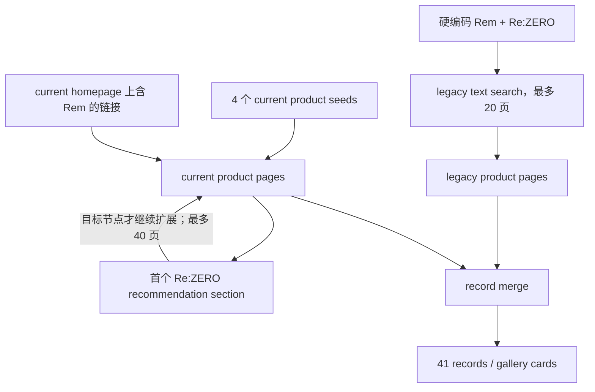

# Good Smile 41 条链路审计

## 审计对象

只读检查了外部成果中的 `collector.py`、`figures.json`、`gallery.html`、`README.md`、`seeds.txt` 和依赖说明。没有修改该目录，没有执行新的全量收集。Figure Gallery 对照来自本地已有蕾姆 11 条 / 89 图证据。

## 41 条如何被发现

这不是一个泛化的“Good Smile scraper”，而是两个不同机制的合并：



- `sync` 执行 legacy 文本搜索，再执行 current seed/homepage/recommendation 图。
- `refresh` 跳过 legacy 搜索，只重新运行 current 图并与历史 JSON 合并。
- 冻结结果为 34 个 legacy-primary 与 7 个 current-primary record；41 条 JSON 与 41 张 gallery card 的标题和顺序一致。
- 全部记录有 14 个原始 manufacturer label；规范化 `KADOKAWA Corporation → KADOKAWA` 后约 13 个实体。在范围 33 条为 13 个原始 label、约 12 个规范实体。
- 没有 current catalog search、角色/作品页、sitemap 或通用任意角色输入。
- 推荐只取第一个文本含 Re:ZERO 的 section；非目标中间节点不扩展，且存在 40 页上限。

## Seed dependency

| 指标 | 观察 |
|---|---:|
| configured seeds | 4 |
| exact seed roots in final data | 4 |
| non-direct-seed records | 37 |
| 有确定 legacy-search 路径的 identity | 35 |
| 无 seed 时未证明可达的 current records | 4–6 |
| 保存 parent edge / depth | 否 |

34 是 legacy-primary record 数；35 个可由 legacy 文本路径到达的 identity 还包括 current-primary Nendoroid `58677`，其合并记录保留了 legacy `5863` 路径。两者口径不同，并不矛盾。

因此“只输入 Rem/Re:ZERO 能自动得到 41 条”的答案是**不能**。Legacy historical discovery 的 seed dependency 低；current discovery 的 seed dependency 高且不可审计。实际最大深度、isolated records 和 recommendation completeness 无法从冻结数据重建，必须保持 `unknown`。

## 范围重分类

```text
41 source records
├─ 33 in scope
├─ 7 out of scope
└─ 1 ambiguous
```

明确 out-of-scope：KADOKAWA plastic model、Nendoroid Rem、Nendoroid Doll、Harmonia humming doll、Nendoroid Swacchao、figma、Nendoroid Childhood Ver。

唯一 ambiguous 是 POP UP PARADE Rem: Ice Season Ver.：标题/品类通常指向完整静态 PUP，但冻结的 `specifications` 明写 `articulated`。未回源核验前不应猜测。

## Offering、release 与 prototype

41 条首先保守保留为 **41 个 probable version/catalog offering candidates**；其中 5 条 release 文本明确同时包含初版与再版，因此可确认的 release event 下限是 46。研究归并识别了 6 个高置信二合一 prototype group：

| Group | 两条 offering | 归并理由 |
|---|---|---|
| Bunny 2nd | Bunny Ver. 2nd / Bare Leg Bunny Ver. 2nd | FREEing、1/4、尺寸、原型师一致；裸腿为版本变化 |
| Bunny | Bunny Ver. / Bare Leg Bunny Ver. | FREEing、1/4、尺寸与原型师一致 |
| Graceful Beauty | 原版 / 2024 New Year | maker、1/7、尺寸一致；现有说明明确为色装变体 |
| Birthday 2021 | Celebration Set / Rem single | maker、1/7、尺寸、原型师一致；套装与单品关系 |
| Ukiyo-e | 原版 / Cherry Blossom | maker、1/8、尺寸、原型师一致；主题色变体 |
| Birthday | Complete Set / Rem single | maker、1/7、尺寸、原型师、release 一致 |

得到约 35 个全部 probable prototypes，其中当前范围约 27。该结果只是 `prototype candidate grouping`，没有写回正式数据。

一个实现缺陷进一步说明不能直接迁移原 collector：高度解析器取规格中的最后一个毫米值，把部分底座、坐垫或床尺寸误当手办高度；而 identity key 又依赖这个高度。当前/legacy maker 名称和数字 ID 也会变化。

## 与 Figure Gallery 蕾姆 11 条对照

| 项目 | prototype 数 |
|---|---:|
| Existing Figure Gallery | 11 |
| Good Smile in-scope | 27 |
| exact/probable intersection | 8 |
| Good Smile marginal | 19 |
| union | 30 |
| FG-only | 3 |

交集包含 5 个 exact stable-ID 对应和 3 个 legacy→current probable same-product 对应。Good Smile 侧另有两个 offering 是已覆盖 prototype 的版本，因此 record overlap 与 prototype overlap 不能混用。若 ambiguous PUP 后续证实静态，Good Smile in-scope、marginal、union 均各加 1。

逐条 scope、reason、prototype group、FG match 与 12 张图片判定见小型脱敏证据 [`goodsmile-audit.json`](../evidence/catalog-hub-discovery/goodsmile-audit.json)；详细口径见 [`PROTOTYPE_COVERAGE.md`](PROTOTYPE_COVERAGE.md)。

## 图片价值

冻结记录有 326 个 URL，全部 URL 字符串唯一；每商品 4–14，中位数 7、均值 7.95。主机分布为 legacy `images.goodsmile.info` 256、current `www.goodsmile.com` 69、Google storage 1。原 gallery 每卡仅展示第一张图，不是 326 图详情图库。

本轮只在临时目录下载 3 个商品各 4 张，共 12 张；没有提交任何图片：

| 样本 | HTTP/哈希 | 完整造型 | 角度观察 |
|---|---|---:|---|
| current Breather in the Garden | 4/4，4 个 SHA-256 | 2/4 | 正面、背面/细节 |
| legacy GSC Rem | 4/4，4 个 SHA-256 | 3/4 | 正面、侧前、背面 |
| legacy PUP Ice Season | 4/4，4 个 SHA-256 | 1/4 | 正面为主，其余近景 |
| 合计 | 12/12，exact duplicate 0 | 6/12 | 2/3 商品有正背或多角度 |

12/12 都可作为造型或细节参考，但只有一半完整展示从头到脚/底座。结论是 **Good Smile 具有高密度媒体候选价值，但小样本不足以证明它能单独成为长期主要媒体源**。媒体权利、URL 寿命和跨格式视觉重复仍需独立门禁。

## 长期稳定性与许可

- current 与 legacy 数字 ID 不是统一命名空间；已观察到同品 ID 迁移，必须保存 source namespace 和 crosswalk。
- Legacy 页面保留带来历史价值，但没有 SLA、公开 dump 或 API。
- [current robots.txt](https://www.goodsmile.com/robots.txt) 明确禁止 `/*/search`；本轮没有访问该搜索路径。
- [Good Smile Terms of Use](https://www.goodsmile.com/en/terms-of-use) 未提供目录自动化、复制或持久入库授权。
- [官方媒体使用说明](https://support.goodsmile.com/hc/en-us/articles/14950716410521-Usage-of-Good-Smile-Company-products) 说明 Good Smile 通常无权替角色版权方授予图片使用权。

最终评级：

| 维度 | 结论 |
|---|---|
| technically stable | 中；现有目录高产，但模板、ID、legacy 域和推荐图均脆弱 |
| redirects | 只从冻结 crosswalk 观察到 legacy/current 同品迁移；没有系统 live redirect 测试 |
| canonical | 冻结数据未保存 canonical，本轮未系统验证 |
| permission | **unclear**；搜索路径另有 robots block |
| Historical Hub | 获许可后值得使用，但不能作为唯一历史真值 |
| Media source | 候选质量高；权利与长期保存需单独解决 |
| 可复用代码 | 不直接复制；重写最小、可审计、带 provenance 的 connector |
