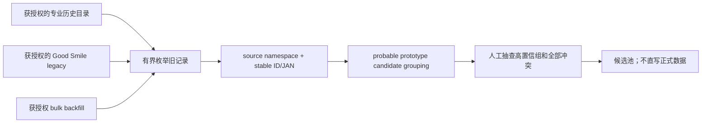

# Historical Bootstrap 与 Incremental Discovery

## 两个问题不能使用同一最优来源

Historical 的目标是尽量补齐过去十年的在范围原型；Incremental 的目标是新商品发布后尽快、低成本发现。停售保留强的旧目录未必有 update cursor；实时 marketplace API 也未必保留停售商品。

| 维度 | Historical bootstrap | Daily incremental |
|---|---|---|
| 核心指标 | probable prototype recall | discovery latency / daily request |
| 理想通道 | bulk dump、old catalog、sold-out retention | RSS/feed、updated-since、cursor、new arrivals |
| 典型来源 | Good Smile legacy、获许可的 HobbySearch/MFC/MFL | CDJapan RSS/bulk、Rakuten Item update sort、厂商 new-product feed |
| 搜索方式 | 有界按角色/作品回填可接受 | global ingestion，禁止每日按角色×来源重搜 |
| 停止条件 | 页码/游标穷尽或明确 cap | cursor checkpoint / feed watermark |
| 审核 | 原型归并、版本/套装/再版 | 新候选与已有 identity/digest 比较 |

## Historical 推荐流程



Good Smile 证明 legacy 文本目录可以低 seed、高历史产出，但也暴露 ID 迁移、字段解析和 provenance 缺失。新的 Historical connector 必须保存 query/page/cursor、parent edge、fetch time、raw digest 和 source namespace。

Rakuten/Yahoo 的 3000/1000 结果窗口和停售不保证，使它们不能单独宣称历史全量。没有 dump/feed 或可穷举 cursor 时，global historical bootstrap 不可靠；可按角色限次回填，但必须记录 cap 与 `partial_by_limit`。

## Incremental 推荐流程


日常不能这样做：

```text
for every Character:
  for every source:
    search the internet again
```

新商品应先全局摄取一次，再离线解析角色。没有 updated cursor 的来源只作线索；不能声称完整增量。来源状态、last seen 与内容 digest 分开保存，来源删除不能自动删除正式媒体或正式数据。

## 100 / 1000 角色的切换点

定义：

```text
Q_hist = R × Σh(Ah × Ph + Dh)
Q_day_character = R × Σh(Ah × Pdelta_h)
Q_day_global = Σh(Fh) + Σgap(Fgap)
R* = Q_day_global / Σh(Ah × Pdelta_h)
```

在 3 个 Hub、每源约 2 个 alias、每日每 alias 1 页，以及 global 11–85 请求/日的规划假设下，`11–85 ÷ 6` 的交叉点约在 2–14 个角色。即使区间很宽，100 或 1000 角色都明显应使用 global incremental ingestion。

## 发现时延目标

本轮不建立无法验证的 SLA。下一轮获授权 feed 实验应测：

- source publish → feed 可见；
- feed 可见 → connector ingest；
- ingest → identity match；
- identity match → reviewer 可见。

日常任务应按 watermark/cursor 运行；失败时保留上次 checkpoint，并在恢复后重放，不用按角色全网补搜。
