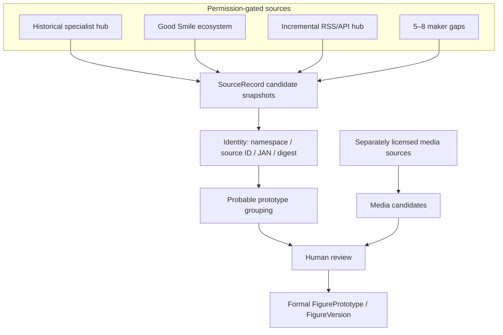

# 推荐数据供应链

## 阶段性决策

采用“许可优先、少量 Hub + 少量 maker gaps、发现/身份/媒体分层”的方向；不立即实现任何生产 connector。

## 最少连接器方案

名义最小方案是 8 个：3 个主要 Hub + 5 个 direct maker gaps。覆盖率 union 尚未获授权实测，因此为风险缓冲建议规划 5–8 个 gap，而不是宣称五个一定足够。

### 三个主要 Hub 职责

1. **Historical/Identity hub**：获许可的 HobbySearch 或专业 figure database feed（MyFigureList/MFC）。
2. **Good Smile ecosystem hub**：legacy backfill + current catalog；必须重写可审计 discovery，不能复制现 collector。
3. **Authorized incremental retail/API hub**：首选 CDJapan RSS/bulk；Rakuten 只在持久化条款书面澄清后作结构化交叉验证。

### 初始 maker gaps

优先验证 FuRyu、Taito、Bandai Spirits/Banpresto、KADOKAWA、APEX/ALTER。APEX 与 ALTER 是否拆成两个 connector、以及是否还需 SEGA 等景品来源，应由获授权 Hub 的 marginal union 决定；规划区间为 5–8。

不要因为外部 collector README 写了某几个厂商，就直接实现它们。每个 gap 要先证明 `marginal reviewed prototypes / engineering hour` 高于下一个 Hub/合作来源。

## 分层架构

关键约束：

- 来源 connector 只能写候选/快照，不覆盖正式 Work、Character、Manufacturer、FigurePrototype、FigureVersion 或主图。
- source record、offering/version、release event、prototype 必须分层。
- public URL 不是 identity；保存 source namespace、stable ID/JAN、canonical URL、content digest。
- 媒体下载、长期保存和公开展示单独过权利门禁。
- 来源消失不自动删除已经人工提升的正式媒体或正式数据。

## Permission gate

实现前必须得到可存档证据，明确允许：

1. 自动读取或 feed/API 使用；
2. 复制必要元数据；
3. 在项目所有者私有 catalog 中长期保存；
4. 做 identity/prototype 归并和导出；
5. 对图片分别规定下载、缓存、公开展示与删除义务。

robots 未禁止、HTTP 200、官方 API 或个人用途都不是完整授权。当前 production-ready connector 数是 0。

## Historical 组合

最佳技术组合是：获许可的专业历史目录 + 获许可的 Good Smile legacy + CDJapan authorized bulk backfill。HobbySearch/MFC/MFL 谁成为主干取决于书面许可与可穷举 export，不由页面规模决定。

若无 dump/cursor，只能按角色有界 bootstrap，并明确 `partial_by_limit`；不可把 marketplace API 的分页上限当全量。

## Incremental 组合

优先 global CDJapan RSS/bulk；补充获授权、可按更新时间排序的 retail API；厂商 gap 使用 new-arrival/feed。全局摄取一次后离线匹配所有角色，不按角色重复搜索互联网。

## Discovery 与 Media 分开

| 来源例子 | Discovery | Identity | Media | 结论 |
|---|---|---|---|---|
| Good Smile | 高 | 高但ID迁移 | 小样本高 | 权利不清，不能单独承担 |
| Rakuten API | 中高 | JAN/productId较好 | 很低分辨率、张数少 | 适合交叉验证，不适合主媒体 |
| MyFigureList/MFC | 高 | 高 | 社区/来源权利混合 | 合作后作目录，媒体仍需分离 |
| maker official | 中 | 高 | 通常高 | 作为 gap 和媒体核验，不必每厂先建全量 connector |

## 下一轮唯一推荐验证

**先取得并验证 CDJapan RSS/bulk database 的授权访问及持久私有 catalog 权利。**

验证内容只包括 Rem/Cheshire 小样本、feed/bulk 字段、历史深度、stable ID/JAN、updated watermark、持久化许可和 attribution；不写正式 connector。如果授权或历史回填不足，停止并把下一优先切换为 HobbySearch/MyFigureList 的数据合作谈判，而不是回到大规模 Web Search。

## 重新评估触发条件

- 任一 Top 4 提供正式 API/export 或明确拒绝；
- 取得第一个可穷举历史数据集；
- 两个来源完成 prototype-level union；
- 发现 Hub 对 scale/prize 的 marginal recall 低于单 maker；
- 图片权利要求与产品图库目标冲突；
- 连接器维护或审核成本超出 [`ECONOMICS.md`](ECONOMICS.md) 区间。

## 不在本轮做的事

不创建正式 adapter，不迁移 spike，不访问 Hpoi，不增加角色，不启动 PR-02，不部署。现有研究仅为下一次许可与小样本门禁提供排序。
