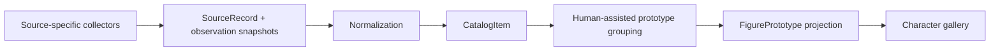

# Figure Gallery 架构保留与瘦身审查

## 1. 结论

本轮选择 **B. SIMPLIFY AND CONVERGE**。

保留 Figure Gallery 最有价值的领域判断：角色、来源、商品、手办原型不是同一层；最终角色页仍应以 `FigurePrototype` 为一张独立姿势卡；稳定身份、来源隔离和人工封面选择仍然正确。与此同时，暂停把完整后台治理、事务命令、逐字段审核、对象存储和生产门禁当成获得可用数据之前的前置条件。高召回 Collector 继续独立、快速地工作，产品层先解决来源归属、商品归一和原型分组。

这不是放弃 Payload CMS + Next.js 的已接受技术决策，也不是重建正式应用。它是在调整实施顺序：先用真实数据验证最小数据链，再把已经证明必要的边界正式化。

## 2. 285 条数据改变了什么

当前本地数据证明了以下事实：

- 宽目录 330 条经 Collector 规则过滤后保留 285 条 Catalog Item；这不是 285 条全量人工资格确认，129 卡样本至少发现 1 条低价值半身像漏网；
- 其中 186 条为 Prize，Prize 已是当前蕾姆姿势参考库的主体；
- 284/285 条有至少一张图片，171 条有至少两张图片；
- 285 条不是 285 个已确认的独立原型，而是包含来源重复、再版、异色、渠道版和相近系列的商品层记录；
- Collector 在合并来源时会丢失字段级 provenance：32 条最终标记为 Good Smile 的记录中，29 条含 Solaris 才提供的字段，1 条含 Japan Figure SKU；这说明数据层的第一个缺口是 `SourceRecord`，不是更复杂的 Admin 操作。

因此，原方案最大的工程化错误不是选错技术栈，也不是所有领域概念都错误，而是**排序错误**：在真实的高召回数据和 CatalogItem→Prototype 分组问题得到验证前，先优化了完整审计、命令矩阵、审核工作台、基础设施和生产门禁。真实数据阶段首先出现的是来源混合和商品/原型层级混淆，而不是多管理员事务冲突或灾备恢复。

## 3. 判断口径

本文件只使用以下五种决策：

- `KEEP NOW`：当前 285 条数据整理和可用图库立即需要；
- `KEEP LATER`：解决的是真问题，但尚未在当前阶段形成阻塞；
- `SIMPLIFY`：问题已经存在，但原设计超过当前所需复杂度；
- `FREEZE`：停止继续扩展或接入当前数据链，保留历史实现和研究证据；
- `REMOVE`：从新的最小数据链中删除错误假设或会破坏数据语义的做法，不表示删除历史文件。

“问题是否已出现”只表示当前 285 条真实数据是否已给出证据。标记 `premature` 的设计可以在触发条件出现后恢复，不等于永久否定。

## 4. 旧架构瘦身表

| 旧设计 | 当前决策 | 解决的真实问题 | 285 条阶段是否已出现 | 原因与当前动作 |
| --- | --- | --- | --- | --- |
| Work | `KEEP LATER` | 同名角色按作品消歧、作品级归档 | 单角色数据中未形成阻塞，`premature` | 保留概念和可选 `work` 文本，不要求 Collector 或第一轮 grouping 先建立独立 Work 记录 |
| Character | `KEEP NOW` | 数据集边界、搜索入口、跨来源名称统一 | 已出现 | 每次数据集、商品和原型都必须可追溯到稳定角色；先保留最小记录 |
| CharacterAlias | `SIMPLIFY` | 中/日/英名、别名发现和搜索 | 已出现 | 先作为 Character 内嵌规范化列表，不要求独立 Collection、偏好 locale 状态机或完整审计 |
| Manufacturer Collection | `SIMPLIFY` | 统一厂商拼写、筛选和统计 | 已出现 | 当前先保存 `rawManufacturer` 和 `normalizedManufacturer`；用版本化 alias map 规范化，暂不以独立 Collection 阻塞入库 |
| FigurePrototype | `KEEP NOW` | 把同 sculpt/同姿势的商品版本聚合为前台一张卡 | 已出现且是当前核心缺口 | 保留为最终前台核心实体，但只先建立可修订 grouping manifest，不实现自动 merge |
| FigureVersion | `KEEP LATER` | 表达再版、异色、豪华版、渠道版等同原型变体 | 已出现概念，独立实体仍 `premature` | 先把版本事实保存在 CatalogItem；当一个原型下版本关系稳定、需要独立维护时再实体化 |
| FigurePrototypeCharacter | `SIMPLIFY` | 多人手办与角色 M:N、主次展示顺序 | Rem/Ram 等多人套装已经出现；独立关系 Collection 仍属 `premature` | 现在必须保留 `characterIds` 多值关系；出现关系级顺序、角色或证据字段后再恢复独立关系实体 |
| OperationLog | `SIMPLIFY` | 记录人工判断、定位错误、支持可追溯修订 | grouping 决策已需要轻量记录；完整事件系统 `premature` | 先记录 snapshot 版本、分组决定、操作者/原因和前后值；不要求每个普通字段都生成企业级可逆日志 |
| 单一 Catalog Command endpoint + 30 个 command variant | `FREEZE` | 禁止通用 CRUD 旁路，保证正式目录写入一致性 | 当前离线采用链未需要；`premature` | 事实是一个 `POST /api/admin/catalog/commands` endpoint，不是 30 个 endpoint。保留 PR-01 代码，不再把 Collector 接入或继续扩展 command variant |
| Candidate / Review workflow | `SIMPLIFY` | 防止来源自动覆盖正式数据、处理不确定匹配 | 来源与正式结果隔离已出现；逐字段强制审核 `premature` | Collector 输出批次先进入 staging；确定性归一自动通过，只有来源冲突、低置信分组、封面和排除项进入异常审核 |
| Stable UUID | `KEEP NOW` | 路径、导出、重新采集和未来迁移中保持身份不变 | 已出现 | Character、SourceRecord、CatalogItem、FigurePrototype 从第一份采用快照即使用稳定 ID；外部 source ID 不替代业务 ID |
| Transactional command services | `KEEP LATER` | 多记录正式写入、并发和审计的原子性 | 当前离线单写者 manifest 未形成阻塞，`premature` | 正式多管理员写入 PostgreSQL 时恢复；当前使用不可变输入、原子文件替换和可重建投影即可 |
| merge / split / specified undo | `FREEZE` | 修正已发布原型分组且不破坏关系 | 疑似重复已出现，但正式关系和依赖尚不存在；完整服务 `premature` | 本轮只生成可编辑、版本化映射；不执行自动合并，不继续开发事务级 merge/split/undo |
| PostgreSQL | `KEEP LATER` | 多用户并发、约束、查询、迁移与可靠持久化 | 285 条离线单角色数据不需要，`premature` | 保留正式生产边界；在原型分组规则和导入合同稳定后再导入，不以数据库为研究前置条件 |
| S3 | `KEEP LATER` | 大量媒体持久化、对象清单、备份和多实例读取 | 当前本机内容寻址目录可用，`premature` | 保留稳定 storage key 原则；只有媒体进入正式应用或需要跨环境运行时才迁移到 S3 |
| Payload Admin | `KEEP LATER` | 多管理员正式维护、权限和结构化审核 | 当前个人图库尚未出现，`premature` | 先用极小的离线分组/封面清单；出现持续人工审核吞吐后再建设定向 Admin View，不做通用复杂后台 |
| Complex CI gates | `SIMPLIFY` | 防止正式 schema、权限、恢复和生产构建回归 | 对正式应用有价值；对数据探索并非同一风险 | 数据供应链只跑 schema、幂等、计数、provenance、fixture 和无凭据检查；正式应用生产门禁保留在正式变更路径，不要求每次采集全跑 |
| `1 JSON item = 1 FigurePrototype` | `REMOVE` | 无；它只是早期展示便利假设 | 已被版本/渠道/来源重复否定 | JSON item 明确定义为 CatalogItem；只有显式 grouping 后才能产生 FigurePrototype |
| 把多来源字段 flatten 成单一 `source` | `REMOVE` | 试图快速补全字段 | 已出现错误 provenance | 每个来源保留独立 SourceRecord；CatalogItem 的规范化字段必须能指出依据来源 |

## 5. 按类别汇总

### KEEP NOW

- Character；
- FigurePrototype 作为最终姿势卡实体；
- Stable UUID；
- 新增的最小 SourceRecord 和 CatalogItem 边界。

### KEEP LATER

- Work；
- 独立 FigureVersion；
- 事务型领域服务；
- PostgreSQL；
- S3；
- Payload Admin。

这些能力不是错误，而是不得继续充当当前采用 Collector 的前置条件。

### SIMPLIFY

- CharacterAlias 改为 Character 内嵌别名；
- Manufacturer 先用规范化字符串与 alias map；
- 多角色关系先用 `characterIds`；
- OperationLog 改成轻量批次/分组决定日志；
- Candidate Review 改成 staging + exception review；
- CI 拆成数据供应链快速检查和正式应用生产门禁两条风险路径。

### FREEZE

- 单一 Catalog Command endpoint 后的 30 个 variant 不再为本阶段扩展；
- 正式 merge/split/specified undo；
- 依赖这些能力的复杂 Admin 工作流。

### REMOVE

- `1 JSON item = 1 FigurePrototype`；
- 丢失 provenance 的跨来源字段 flatten。

## 6. Collector 与产品的收敛边界

### Collector 负责

- 宽召回和来源特定解析；
- 低成本增量 refresh；
- 输出原始字段、来源身份、图片引用和观测时间；
- 同一来源内的幂等；
- 不调用完整 Payload Domain，也不决定正式原型或主图。

### 采用/归一层负责

- 保留每个 SourceRecord，而不是覆盖成一行；
- 把多个来源映射为同一 CatalogItem；
- 规范化厂商、类型和 pose eligibility；
- 输出冲突和低置信度队列；
- 生成可重放、可人工修订的 prototype mapping。

### 产品层负责

- 以 FigurePrototype 生成每个独立姿势一张卡；
- 人工选择封面，不允许 refresh 自动替换；
- 详情页展示该原型关联 CatalogItem 的全部可用图片；
- 提供角色、类型、厂商和年代筛选；
- 在需要共享维护和正式发布时，再启用 PostgreSQL、S3、Payload Admin 和正式事务命令。

## 7. Candidate Review 的最小替代

来源数据仍不能自动覆盖正式数据，但“全部字段逐条人工审核”会直接抵消 Collector 的速度优势。当前应采用三层处理：

1. **确定性自动归一**：稳定 source key 幂等、完全一致的重复 source URL、已验证 alias map；
2. **批次接受**：规则版本、输入 digest、计数和异常均一致时，接受整个归一批次进入 CatalogItem staging；
3. **异常审核**：只处理跨源身份冲突、类型不确定、疑似同原型、排除漏网、封面选择和来源字段冲突。

这里的“接受”只建立 CatalogItem 或分组投影，不等于发布到正式 Payload，更不允许来源 refresh 自动改变人工封面。

## 8. 应直接保留的个人图库能力

Collector 的数量优势应与 personal gallery 已证明有用的体验合并，而不是重写复杂后台：

- 角色稳定路由和角色搜索；
- 一原型一封面卡，而非一来源商品一卡；
- 详情页展示全部参考图片；
- 本地内容寻址图片和懒加载；
- 4/3/2 响应式列、原始宽高比；
- 灯箱、缩放、键盘左右切换；
- 类型、厂商、年代筛选；
- 排除/恢复、人工封面和备注持久化。

## 9. 恢复正式能力的触发条件

| 能力 | 恢复触发条件 |
| --- | --- |
| Work Collection | 第三个及后续角色出现实际同名消歧，或作品成为筛选/管理维度 |
| Manufacturer Collection | alias map 不能可靠统一厂商，或需要厂商状态、证据和独立维护 |
| FigureVersion | 同一 Prototype 下的版本属性需要独立编辑、查询或来源关系 |
| Transactional services / OperationLog | 出现两个写者、跨记录正式修改或发布数据 |
| merge/split/undo | 已有稳定 Prototype 数据、下游引用和真实修订场景 |
| PostgreSQL | 数据不再是单机单写者快照，或正式应用需要查询与约束 |
| S3 | 媒体需要跨环境持久化、共享读取、备份恢复或正式发布 |
| Payload Admin | 异常审核量超过简单 manifest 可安全处理，且字段/操作合同已稳定 |
| 完整生产 CI | 正式 schema、权限、媒体或部署路径重新开始变更 |

## 10. 当前边界

本审查不修改 Collector，不把 285 条导入 Payload，不开始 PR-02，不建立新 Collection，不实现原型自动 merge，不访问 Hpoi，也不改变 Payload CMS + Next.js 的 ADR。它只重新安排从真实数据到正式产品的最短顺序。
