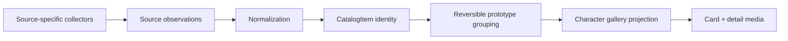

# Collector-to-gallery pipeline

## Goal

Adopt the collector's throughput without importing its flattened JSON as
formal truth and without requiring each source adapter to implement the full
Payload domain.



## Separation of responsibilities

| Layer | Owns | Must not own |
| --- | --- | --- |
| Collector | discovery, source parsing, low-cost filtering, raw evidence, first/last seen | product UUID, formal prototype truth, cover choice |
| Source observation | source namespace/ID/URL, observed fields and image origins, digest, collector version | cross-source canonical identity |
| Normalization | manufacturer aliases, product type hints, character mapping, normalized title | destructive source rewriting |
| Catalog | one sale/catalog offering across source pages, source crosswalks, version hints | automatic prototype equivalence |
| Prototype grouping | reversible assignment of catalog items to a pose/sculpt identity, confidence/reason | deleting or merging source evidence |
| Gallery | one card per prototype, preferred cover, filters, detail images, preferences | discovery crawling or source-specific parsing |

## Phase-bound data contract

The collector exports a versioned, append-preserving snapshot. Each observation
must include:

- source namespace and source item ID, or a normalized source URL fallback;
- source URL and observation timestamps;
- raw fields plus optional source-specific parsed hints with a parser-rule
  version; canonical normalization is produced by the next layer, not imposed
  on every adapter;
- every image URL with its source page and source namespace;
- record digest and collector/parser version;
- eligibility outcome and reason, including excluded records in the run audit.

The present `figures.json` cannot fully produce this contract after the fact:
45 rows already flatten multiple sources. Known Shopify store prefixes permit
aggregate inference, but no explicit field/image-to-SourceRecord relation was
stored. Adoption therefore starts at the collector export boundary for future
runs while keeping the current file as a frozen benchmark.

## Identity and idempotency

1. A `SourceRecord` identity is `(sourceType, sourceItemId)`; use a normalized
   canonical URL only when the source exposes no stable ID.
2. A `CatalogItem` identity is product-owned and may crosswalk many
   `SourceRecord` identities. Matching is evidence with confidence, not a source
   ID transplant.
3. A `FigurePrototype` identity is also product-owned. Assigning or reassigning
   a CatalogItem changes a mapping, not the source or catalog identity.
4. Re-running a collector updates `lastSeenAt` and adds a new digest only when
   fields change; it does not create another SourceRecord or CatalogItem for the
   same source key.
5. Cover selection and user exclusions are independent preferences and cannot
   be overwritten by refresh.

## Version/prototype rule frame

- Re-release, package renewal and retailer-page duplication normally remain
  separate SourceRecords or CatalogItems under one prototype.
- Pure recolor, online-crane color, Last One color or a minor accessory change
  are version candidates under one prototype when the sculpt/pose is the same.
- A changed body pose, garment geometry, base interaction or multi-character
  composition is a different prototype even when the series title is similar.
- Uncertain cases stay ungrouped or enter `needs_review`; no heuristic silently
  merges them.

The next phase stores version hints on `CatalogItem`; it does not yet require a
formal `FigureVersion` collection.

## Images

At ingestion, retain source URL, source page, source namespace, media role hint
and observed order. When a file is actually cached, add MIME, dimensions,
byte size and SHA-256. Content hashing can deduplicate local bytes, but URL or
hash equality never decides prototype identity.

The gallery projection selects one cover per prototype and exposes the union of
eligible detail images. A cover can only reference a cached, SHA-256-verified
content object plus its append-preserved source ImageRef. A source disappearing,
a later refresh, or a candidate being excluded must not reset that manual cover
or delete a locally retained image that is still referenced. Full S3 lifecycle
and perceptual hashing remain later work.

## Exception-only review

High-confidence observations can be normalized into CatalogItems in a batch.
Manual work is reserved for:

- conflicting source crosswalks;
- ambiguous product type or pose eligibility;
- uncertain catalog-to-prototype grouping;
- changed source fields that would affect display;
- cover choice and visibly poor/irrelevant images.

This retains human control without reintroducing the full field-by-field
Candidate/Review workflow as a throughput bottleneck.

## Failure and rollback

- Source observations are append-preserving; a failed normalization run can be
  discarded and replayed.
- Catalog/prototype assignments live in a separate mapping manifest with actor,
  timestamp, reason and previous assignment.
- A correction appends a new decision rather than destructively merging rows.
- No formal Payload import is part of this review.

## Product projection

The two existing gallery surfaces solve different problems:

| Surface | What already works | What must change or be combined |
| --- | --- | --- |
| Collector gallery | many records appear quickly; implementation is small and easy to regenerate | one commercial item becomes one card; only the first image is shown; flattened `source` copy can be wrong; there is no all-images detail, cover selection or character-level product experience |
| Figure Gallery personal gallery | one card/cover, all-images detail, local media, lightbox/zoom, 4/3/2 layout, preferences and character routes | it needs the new CatalogItem-to-Prototype projection and must not depend on slow per-product discovery |

The recommendation is to keep the collector gallery as a fast audit output and
feed its data into the personal gallery interaction model. Neither existing
surface alone is the final data architecture.

The first useful projection is deliberately small:

```text
character search/route
  -> type, manufacturer and era filters
  -> one FigurePrototype card and preferred cover
  -> detail view with all eligible reference images
```

Reuse the personal gallery's local-media, 4/3/2 grid, lightbox, zoom,
keyboard navigation, exclusion/restore and notes. The collector's one-item /
one-cover HTML remains an audit surface, not the final product model.
