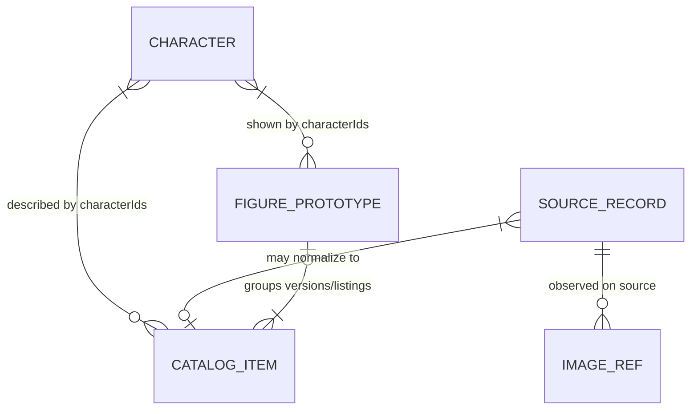

# Collector 采用阶段最小数据模型

## 1. 决策

当前产品最少需要 **4 个业务实体**：

1. `Character`
2. `SourceRecord`
3. `CatalogItem`
4. `FigurePrototype`

`ImageRef` 是嵌入来源记录的值对象，不是第五个独立 Collection。`Work`、`Manufacturer`、`FigureVersion`、`MediaAsset`、`ReviewWorkItem` 和完整 `OperationLog` 暂不作为采用阶段的必需实体。

这个模型描述的是 Collector 输出与未来正式应用之间的最小合同，不授权实现数据库、Payload Collection 或 migration。当前数据仍保存在独立、版本化的离线快照和映射文件中。

## 2. 为什么不是一个扁平 JSON item

当前 285 条 Collector-retained 记录更接近 **Catalog Item**，不是已确认的 285 个 FigurePrototype，也不是逐条人工确认的 285 条高价值姿势：

- 同一商品可以同时被 Solaris、Good Smile 和 Japan Figure 描述；
- 同一 sculpt 可以有再版、异色、渠道版或小配件差异；
- 一个来源页的字段和图片归属于该来源，不能因 merge 而变成另一来源的事实；
- 前台最终希望“一种独立姿势一张卡”，这需要 CatalogItem→FigurePrototype 的显式分组决定。

因此必须同时区分：

| 层 | 定义 | 当前例子中的数量语义 |
| --- | --- | --- |
| SourceRecord | 某一来源页面的稳定身份和当前观察摘要；每批不可变 snapshot 保存历史 | 同一商品可有多个来源记录 |
| CatalogItem | 去除跨来源重复后的可购买/发布商品或版本条目 | 当前 285 条最接近这一层，但仍需来源归一复核 |
| FigureVersion | 同一 sculpt 的再版、异色、渠道/配置版本这一业务概念 | 先作为 CatalogItem 上的事实，不建独立实体 |
| FigurePrototype | 同一 sculpt、姿势和主体构型的正式姿势卡 | 多个 CatalogItem 可以归入一个 Prototype |
| Pose | 可描述姿势的标签或视觉概念，不是第一版独立实体 | 不以“看起来相似”自动合并不同 sculpt |

## 3. 关系



实现约束：

- 一个 SourceRecord 在完成归一后最多映射到一个 CatalogItem；未确定时保持 unmatched，不能猜测；
- 一个 CatalogItem 可以由多个 SourceRecord 支撑；
- 一个 CatalogItem 在完成分组后最多属于一个 FigurePrototype；未分组时 `prototypeId=null`；
- 一个 FigurePrototype 可以聚合多个 CatalogItem；
- 多角色先用稳定 `characterIds` 数组表达，不在当前阶段建立 FigurePrototypeCharacter 关系实体；
- ImageRef 永远保留发现它的 SourceRecord，CatalogItem 和 FigurePrototype 只引用，不复制并改写其来源。

关系只保留一份权威真值：`CatalogItem.sourceRecordIds[]` 是 SourceRecord→CatalogItem 映射的权威；`prototype-mapping.json` 是 CatalogItem→FigurePrototype 映射的权威。SourceRecord 上不重复保存 `catalogItemId`；CatalogItem 的 `prototypeId` 与 FigurePrototype 的 `catalogItemIds[]` 都只是由 mapping 生成的查询/展示投影，必须做一致性检查，不能独立编辑。

## 4. 实体最小字段

以下字段是采用合同，不是立即创建数据库列的指令。时间统一为 UTC ISO 8601；稳定 ID 使用 UUID；所有未知事实使用 `null` 或明确状态，不猜测。

### 4.1 Character

| 字段 | 要求 | 说明 |
| --- | --- | --- |
| `characterId` | MUST | 稳定 UUID，不使用查询字符串或来源角色 ID 代替 |
| `displayName` | MUST | 当前图库显示名 |
| `aliases[]` | MUST | 内嵌中/日/英名和其他明确别名；保存原值与规范化值 |
| `workText` | NICE | 当前只保存可选作品文本；同名消歧成为真实需求后再迁移为 Work |
| `status` | MUST | 最小为 `active` / `hidden`，防止物理删除破坏关系 |

### 4.2 SourceRecord

`SourceRecord` 是最先应引入的正式抽象。它修复当前 flatten merge 造成的来源错配，但保持足够小。这里的 SourceRecord 是稳定的来源身份和“当前观察摘要”，可以推进 `lastSeenAt` 并更新当前 `rawDigest`；不可变的是每次运行的 observation ledger（批次、前后 digest、变化字段和计数）。因此 refresh 不会制造新的来源身份，也不会抹掉历史变化证据。

| 字段 | 要求 | 说明 |
| --- | --- | --- |
| `sourceRecordId` | MUST | 稳定 UUID |
| `sourceType` | MUST | 受控来源名称，如 `solaris`、`good_smile_current`、`good_smile_legacy`、`japan_figure` |
| `sourceItemId` | MUST when available | 来源稳定商品 ID；不可取得时为 `null` |
| `sourceUrl` | MUST | 页面实际 URL，不作为唯一业务 ID |
| `normalizedFallbackUrl` | MUST when no ID | 仅在没有 sourceItemId 时作为 source identity fallback |
| `sourceKey` | MUST | `sourceType + sourceItemId`，无 ID 时为 `sourceType + normalizedFallbackUrl digest` |
| `rawFields` | MUST | 当前成功观察的脱敏字段 map；值保持来源原文，不混入其他来源字段；旧 digest/变化摘要留在批次 observation ledger |
| `imageRefs[]` | MUST | 该页面直接发现的 ImageRef；即使内容相同也保留来源关系 |
| `rawDigest` | MUST | 规范化 `rawFields + image refs` 的 SHA-256，用于 refresh 变化检测 |
| `firstSeenAt` | MUST | 首次成功观测时间，只能单调保留 |
| `lastSeenAt` | MUST | 最近成功观测时间，只能单调前进 |
| `collectorVersion` | MUST | 产生记录的 parser/collector 版本 |
| `adoptionStatus` | MUST | `unmatched` / `matched` / `needs_review` / `excluded`；目标 ID 由 CatalogItem 的权威引用反查，excluded 必须有批次理由 |

最小唯一约束为：

1. 有 `sourceItemId` 时，`(sourceType, sourceItemId)` 唯一；
2. 无 `sourceItemId` 时，`(sourceType, normalizedFallbackUrl)` 唯一；
3. refresh 不创建新 SourceRecord，只更新观测摘要并保留历史批次摘要。

### 4.3 CatalogItem

CatalogItem 表示跨来源归一后的一个商业商品/版本条目。一个 Solaris 页和一个 Good Smile 页确认描述同一商品时，它们是两个 SourceRecord，指向同一个 CatalogItem；字段不相互冒充来源。

| 字段 | 要求 | 说明 |
| --- | --- | --- |
| `catalogItemId` | MUST | 稳定 UUID |
| `characterIds[]` | MUST | 至少一个稳定 Character ID |
| `sourceRecordIds[]` | MUST | 至少一个 SourceRecord；不得只留下“首选 source”而丢失其余来源 |
| `canonicalTitle` | MUST | 展示/归一标题，不覆盖各 SourceRecord 的 raw title |
| `normalizedManufacturer` | MUST | 当前为规范化字符串，不是 Manufacturer FK |
| `itemType` | MUST | `prize` / `scale` / `static_non_scale` / `pop_up_parade` / `other` / `unknown` |
| `poseEligibility` | MUST | `eligible` / `excluded` / `needs_review`；保留判定规则版本 |
| `versionFacts` | NICE | 版本标签、再版、异色、渠道、配置、小配件等原始/规范化事实；当前不是 FigureVersion FK |
| `imageRefs[]` | MUST | 只引用 SourceRecord 中的 ImageRef，可按 SHA-256 去重显示，仍保留多来源引用 |
| `fieldProvenance` | MUST | 规范化字段名→提供证据的 `sourceRecordIds[]`；覆盖每个已设置的 canonical 字段，`versionFacts` 有值时才要求 version provenance |
| `firstSeenAt` | MUST | 所有关联 SourceRecord 的最早首次观测 |
| `lastSeenAt` | MUST | 所有关联 SourceRecord 的最近成功观测 |
| `prototypeId` | DERIVED, nullable | 从权威 `prototype-mapping.json` 投影；未分组不得自动造一个 Prototype |
| `groupingStatus` | DERIVED | 从 mapping 投影为 `ungrouped` / `grouped` / `needs_review` |

字段选择可以有一个 `preferredSourceRecordId` 作为显示策略，但它不能改变字段 provenance，也不能让 CatalogItem 重新拥有外部 `sourceItemId`。

### 4.4 FigurePrototype

FigurePrototype 表示前台的一张独立姿势卡。判断依据是 sculpt、姿势和主体构型，而不是标题相似或来源页相同。

| 字段 | 要求 | 说明 |
| --- | --- | --- |
| `prototypeId` | MUST | 稳定 UUID；即使重新分组也不得复用另一原型 ID |
| `characterIds[]` | MUST | 从已确认 CatalogItem 关系派生并人工复核 |
| `displayTitle` | MUST | 简洁姿势卡标题，不等于任一来源 raw title |
| `normalizedManufacturer` | MUST | 初期规范化字符串；多厂商合作可先保存字符串数组/备注并标记复核 |
| `prototypeType` | MUST | `prize` / `scale` / `static_non_scale` / `pop_up_parade` / `other` |
| `catalogItemIds[]` | DERIVED | 从权威 `prototype-mapping.json` 投影；活动 Prototype 至少一个 CatalogItem |
| `coverImageRef` | MUST before gallery display | 人工选择的 `{sourceRecordId, imageRefKey, contentSha256, localObjectKey}`；只可选择已缓存内容，不得由 refresh 自动替换 |
| `status` | MUST | `draft` / `active` / `hidden` |
| `groupingEvidence` | MUST | grouping rule version、决定原因、决定时间；可包含人工 actor label，不需要完整 OperationLog |

## 5. ImageRef 值对象

`ImageRef` 不建立独立 Collection，嵌入 SourceRecord：

| 字段 | 要求 | 说明 |
| --- | --- | --- |
| `imageRefKey` | MUST | 首次观察时分配、在 SourceRecord 内永久稳定；同一 URL 重见复用，URL 改变则新增引用，不复用旧 key |
| `imageUrl` | MUST | 来源页直接发现的图片 URL；避免与 SourceRecord 的页面 `sourceUrl` 混淆 |
| `role` | MUST | `homepage` / `product` / `other` |
| `sortOrder` | MUST | 来源页中的确定性顺序 |
| `firstSeenAt` / `lastSeenAt` | MUST | 首次与最近一次在来源页观察到的时间 |
| `sourceExists` | MUST | 本次 refresh 未再出现时置 `false`，但不得删除 ImageRef |
| `contentSha256` | NICE; cover 时 MUST | 实际保存文件后计算；没有下载时允许 null，成为封面前必须有值 |
| `mimeType` | NICE | 文件验证后保存 |
| `width` / `height` | NICE | 文件验证后保存 |
| `byteSize` | NICE | 文件验证后保存 |
| `localObjectKey` | NICE; cover 时 MUST | 当前本机内容寻址对象路径；不等于公开 URL，成为封面前必须有值 |

去重分两层：

- 来源层 append-preserving 地保留每个 ImageRef；refresh 只推进 `lastSeenAt` 或把 `sourceExists` 置 false，不能因 URL 消失、相同 URL/哈希或来源失效删除 provenance；
- 展示/存储层有 SHA-256 时按内容只保存一份对象，一个对象可被多个 ImageRef 引用；无哈希时不能声称内容相同。

`coverImageRef` 是人工关系，只能指向已缓存、以 SHA-256 校验的本地内容对象。来源失效、refresh、CatalogItem 隐藏或另一个 URL 出现都不得自动替换已选封面；旧 ImageRef 和内容对象在仍被封面引用时不得清理。S3 在本阶段不是必需，但未来迁移必须让对象使用稳定 storage key，而不是以 source/public URL 为主键。

## 6. MUST / NICE / LATER 字段审查

| 字段/概念 | 分级 | 当前表达 | 理由 |
| --- | --- | --- | --- |
| character | MUST | `characterIds[]` | 数据集边界、搜索和未来多角色关系 |
| work | NICE | Character 的 `workText` | 同名消歧未在单角色数据中阻塞；有则保存，不阻塞 |
| title | MUST | Source raw title + CatalogItem canonical title | 发现、复核和展示基础 |
| manufacturer | MUST | raw + normalized string | 当前已是高价值筛选维度，但无需立刻建 Collection |
| category | NICE | Source raw field | 来源覆盖不一致；用于类型判断但不能阻塞 |
| type / pose eligibility | MUST | CatalogItem 受控枚举和规则版本 | 决定是否进入姿势库；`unknown/needs_review` 不可猜测 |
| scale | NICE | raw + normalized text | 仅部分记录稳定可得；不能阻塞 Prize 或 non-scale |
| height | NICE | raw/normalized value | 对拍摄参考有用但覆盖低 |
| release | NICE | raw date/text | 年代筛选有用，缺失不阻塞 |
| price | NICE | 来源值 + currency | 不是第一版产品目标，且来源/时间语义不同 |
| JAN / SKU | NICE | 保存在各 SourceRecord | 可帮助 identity，但并非所有来源都有；不得跨来源错误归属 |
| sculptor | NICE | Source raw field | 可辅助原型判断，覆盖不足 |
| availability | NICE | Source raw field + observedAt | 会变化，不应成为原型身份或收录硬门禁 |
| source URL | MUST | 每个 SourceRecord 单独保存 | 来源证据和刷新入口 |
| source ID | MUST when available | SourceRecord sourceItemId；否则 URL fallback | 稳定幂等优先，缺失时不能伪造 |
| images | MUST | SourceRecord ImageRef + CatalogItem 引用 | 姿势参考产品的核心内容；每项仍允许明确缺图异常 |
| tags | NICE | 受控或 raw 标签 | 有助筛选，不应先建设复杂 taxonomy |
| first seen / last seen | MUST | SourceRecord 和 CatalogItem 投影 | 增量 refresh 和变更解释 |
| version | NICE | CatalogItem `versionFacts` | 真实存在，但独立 FigureVersion 仍 LATER |
| prototype | MUST, nullable until reviewed | `prototypeId` + `groupingStatus` | 前台目标实体；不可为满足非空而默认一商品一原型 |
| adult | LATER | 暂不建正式媒体/条目状态 | 当前私有、未发布数据阶段不阻塞；公开产品前必须重新定义和审核 |
| gray prototype | LATER | 暂保留在 raw category/tags | 当前真实供应链主要是商品图；没有足够稳定字段支持正式状态机 |
| independent Work | LATER | 当前 `workText` | 同名消歧或作品维护出现后再建 |
| independent Manufacturer | LATER | 当前 normalized string | 需要状态/证据/独立管理时升级 |
| independent FigureVersion | LATER | 当前 `versionFacts` | 分组关系稳定并需要独立维护时升级 |
| independent MediaAsset | LATER | 当前 ImageRef + content object | 正式 S3、生命周期和共享引用时升级 |
| pHash / pose embedding | LATER | 无 | 可做提示，不能替代人工原型判断；本轮不实现 |

## 7. 身份策略

### 7.1 三种身份不得混用

1. **来源身份**：`sourceType + sourceItemId`，缺失时才用规范化 URL fallback；
2. **商品身份**：采用层分配的稳定 `catalogItemId`，可关联多个来源身份；
3. **原型身份**：人工/规则复核后分配的稳定 `prototypeId`，可关联多个商品身份。

Collector 当前已有的内部 ID 可以作为迁移输入，但不能不经验证直接成为 CatalogItem 或 Prototype 的永久 ID。采用快照一旦分配 stable UUID，重新采集、字段变化或来源 URL 变化都不能生成新业务身份。

### 7.2 幂等

- 同 source key + 同 raw digest：SourceRecord `unchanged`，仅单调推进 `lastSeenAt`；
- 同 source key + 不同 raw digest：记录 `changedFields`，不覆盖历史批次摘要；
- 新来源疑似已有商品：进入 CatalogItem identity matching；低置信度进入 `needs_review`，不新建重复商品也不自动强并；
- grouping manifest 重放必须产生相同 CatalogItem→Prototype 映射和计数。

## 8. 字段 provenance 策略

不再使用单一 `source` 标签描述一个混合 record。最小规则是：

1. 每个 SourceRecord 只保存自己页面实际提供的值；
2. CatalogItem 可选出 canonical value，但 `fieldProvenance[field]` 必须指向一个或多个 SourceRecord；
3. 多源冲突不以来源顺序静默覆盖，保留候选值并标记 `needs_review`；
4. 来源价格、SKU、source item ID 和来源时间永远留在 SourceRecord；
5. `firstSeenAt` / `lastSeenAt` 的 CatalogItem 值是明确的聚合投影，不伪装成某个来源字段；
6. 图片始终可追到直接发现它的 source page。

最小 provenance 不是完整企业级字段事件流：不保存完整网页、请求 header、Cookie 或每次无变化 fetch；只保留解析字段、摘要、来源 ID/URL、观测时间和批次 digest。

## 9. 版本与原型分组规则

当前不实现自动算法，只定义人工抽样和未来 mapping 应遵守的框架：

| 情况 | CatalogItem 表达 | Prototype 处理 |
| --- | --- | --- |
| 同一 retailer/厂商商品的重复来源页 | 多 SourceRecord → 同一 CatalogItem | 不增加 Prototype |
| 明确 re-release / renewal 且 sculpt、姿势、主体构型相同 | 单独 CatalogItem，`versionFacts=reissue/renewal` | 归入同一 Prototype |
| Special Color / recolor 且 sculpt 相同 | 单独 CatalogItem，保存配色事实 | 归入同一 Prototype |
| Online Crane / Last One / channel exclusive，仅渠道或包装不同 | 单独或同一 CatalogItem 取决于是否为独立商品身份 | sculpt 相同则同一 Prototype |
| 小型可拆配件差异，主体姿势与 sculpt 不变 | 单独 CatalogItem，记录 accessory facts | 通常同一 Prototype，低置信时人工复核 |
| 相同系列名但姿势、服装 sculpt 或主体构型不同 | 独立 CatalogItem | 独立 Prototype |
| 仅视觉姿势相似但厂商/原型不同 | 独立 CatalogItem | 独立 Prototype；Pose 相似不等于 Prototype 相同 |
| 无图或证据不足 | 保留 CatalogItem | `prototypeId=null`、`needs_review`，不得猜测 |

`FigureVersion` 是有效的长期概念，但当前所有版本事实都可以先落在 CatalogItem。只有需要单独维护版本状态、来源关系或版本级查询时，才从 CatalogItem 提升为独立实体；提升时不得改变已有 CatalogItem 和 Prototype stable ID。

## 10. 最小离线合同

采用阶段建议输出三个不可变、可版本化的逻辑文件；具体文件名可由下一任务决定：

```text
<batch-id>/source-records.jsonl  # 本批每个来源记录的不可变 snapshot，不覆盖旧批次
catalog-items.jsonl        # 归一商品，带 field provenance
prototype-mapping.json    # CatalogItem -> FigurePrototype 和人工决定
```

每个批次另有 manifest：批次 ID、前一批次 ID、输入 digest、collector version、规则版本、逐记录 changed-fields 摘要、计数、异常数和输出 digest。这样 SourceRecord 可以表示稳定身份+当前摘要，而旧的 observation snapshot 不会被覆盖。运行时不读取 `research/`；这只是后续采用任务的合同设计。

必须满足：

- 输入不变时输出 identity 和 grouping 映射不变；
- 所有 CatalogItem 可追溯到至少一个 SourceRecord；
- 所有图片引用可追溯到直接发现它的 SourceRecord；
- 未分组 CatalogItem 不被伪装为 FigurePrototype；
- 同源刷新不会覆盖人工封面、排除项或 grouping 决定；
- 不保存凭据、Cookie、Authorization header 或完整站点镜像。

## 11. 向正式 Figure Gallery 迁移的边界

### 当前不做

- 不导入 285 条到 Payload；
- 不创建 PostgreSQL migration 或 Collection；
- 不修改 PR-01 的正式目录语义；
- 不把 Collector 改为 Payload client；
- 不建立独立 FigureVersion/MediaAsset；
- 不执行自动 merge。

### 以后迁移时

1. 冻结一份通过 schema、计数、provenance 和幂等检查的采用快照；
2. 先导入 Character 和独立 SourceRecord；
3. 按稳定 ID 导入 CatalogItem 及其字段 provenance；
4. 导入已经人工确认的 Prototype mapping；未确认项继续保持 ungrouped；
5. 只有正式媒体任务开始后，才把已保存内容对象提升为 MediaAsset/S3 storage key，并让 ImageRef 继续作为来源关联；
6. 只有多写者和正式发布开始后，才把 mapping 修订迁移到事务命令和 OperationLog；
7. 每一步对照实体数、关系数、图片引用数和 stable ID digest，禁止用“成功导入”替代一致性证明。

正式 Payload 数据模型可以承接这些实体，但 Collector 不得依赖 Payload Collection、Admin 或 30 个 Catalog command variant 才能继续收集。Collector 与正式应用通过版本化数据合同协作，而不是共享运行时实现。

## 12. 最短验证顺序

下一阶段的数据模型验证只需回答一个问题：**能否把当前 285 个 CatalogItem 用可修订、可重放的 mapping 分成可信的 FigurePrototype，而不丢失任何 SourceRecord 和图片 provenance？**

在这个问题得到真实答案前，不应增加第三角色、不应实现 FigureVersion Collection、不应扩展正式 command、不应引入 PostgreSQL/S3，也不应把分组建议写成自动 merge。
